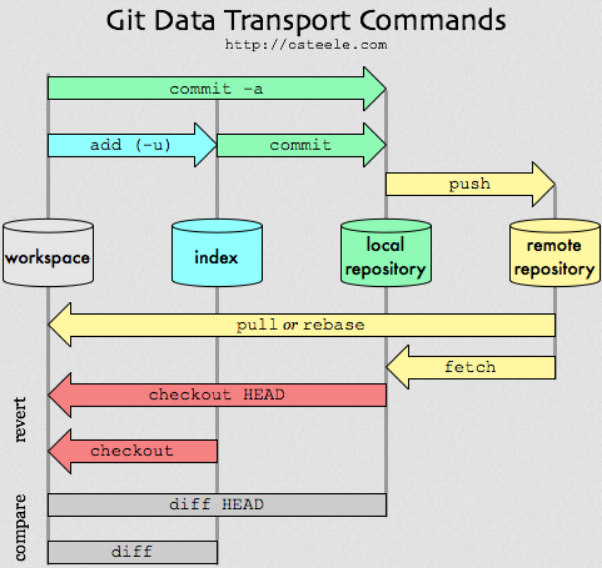

# Git

## Cheat sheet

```bash
# commit
git status
git add <file>...
git add -i
git commit -m "commit message"
git commit --amend

# sync
git remote add origin <server>

git fetch
git pull 		        # git fetch + git merge FETCH_HEAD
git pull --rebase		# git fetch + git rebase FETCH_HEAD

git push
git push origin master

# restore
git restore <file>...
git restore --staged <file>...
git restore --staged --worktree <file>...
git checkout -- <filename>

# reset
git reset <commit>
git reset --soft  HEAD~1	   # keep working tree and index file
git reset --mixed HEAD~1       # default, resets the index but not the working tree 
git reset --hard  HEAD~1	   # resets the index and working tree
git reset --hard  origin/master

# branch
git branch

git switch <new_branch>
git switch -c <new_branch>

git branch <new_branch>
git checkout <branch>
git checkout -b <new_branch>   # git branch _ + git checkout _
git branch -d <branch>

git merge <branch>

# rebase
git rebase -i
git rebase <upstream> [<branch>]
git rebase --onto <newbase> <upstream> [<branch>]

# log
git log
git log --author=link
git log --pretty=oneline
git log --graph --oneline --decorate --all
git log --name-status
git log --follow <file>

#diff
git diff
git diff --stage
git diff <source_branch> <target_branch>

# stash
git stash
git stash list
git pop
git stash drop

# tag
git tag 1.0.0 1234567890

# config
git config --global color.ui true
git config --global core.autocrlf input
git config --global format.pretty oneline
git config --global http.proxy 'socks5://127.0.0.1:1080'
git config --global http.https://github.com.proxy 'socks5://127.0.0.1:1080'

```




## Proxy

### HTTP

See `config` in the [Cheat sheet](##Cheat sheet).

### SSH

- Linux, edit `~/.ssh/config`:

```config
Host github.com
User git
ProxyCommand nc -X 5 -x 127.0.0.1:1080 %h %p
```

- Windows, edit `%USERPROFILE%/.ssh/config`

```config
Host github.com
User git
ProxyCommand connect -S 127.0.0.1:1086 %h %p
```

See Also: [GitHub Gist: laispace/git 设置和取消代理](https://gist.github.com/laispace/666dd7b27e9116faece6#gistcomment-2836692)


## Reference

- [Git Docs](https://git-scm.com/docs)
- [Git Cheat Sheet Education](https://education.github.com/git-cheat-sheet-education.pdf)
- [git - 简明指南](https://rogerdudler.github.io/git-guide/index.zh.html)