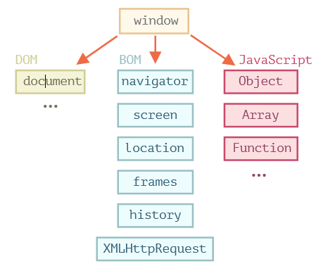
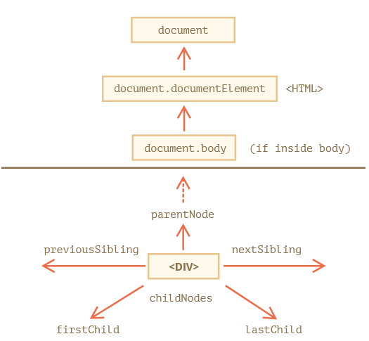
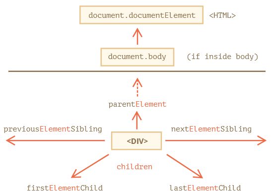
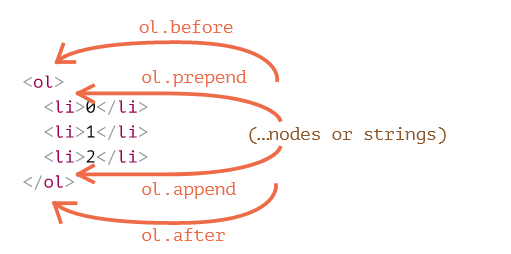
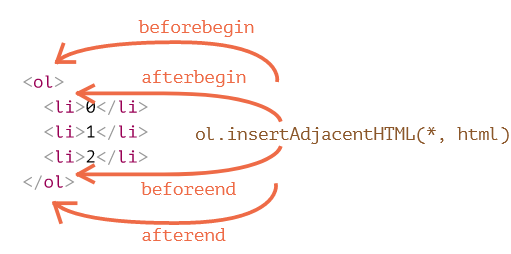
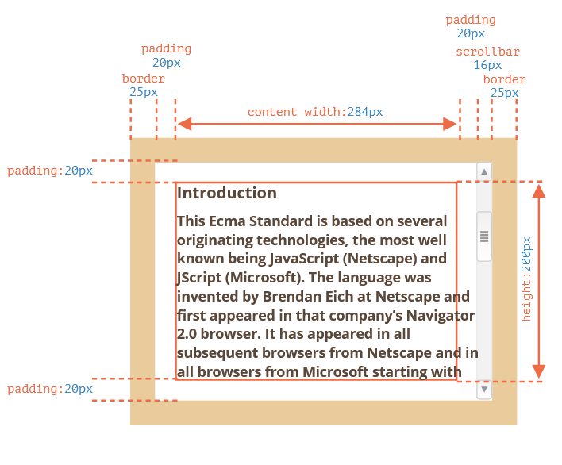
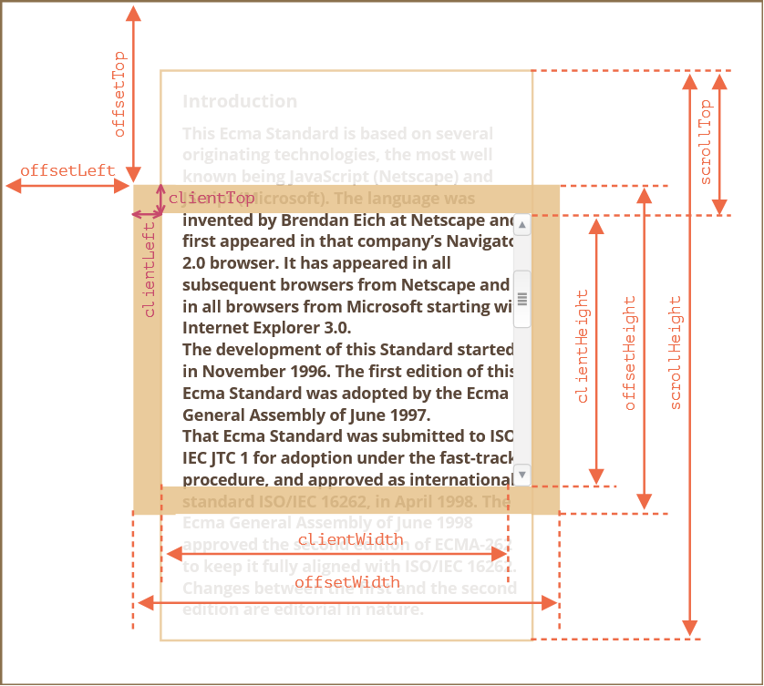
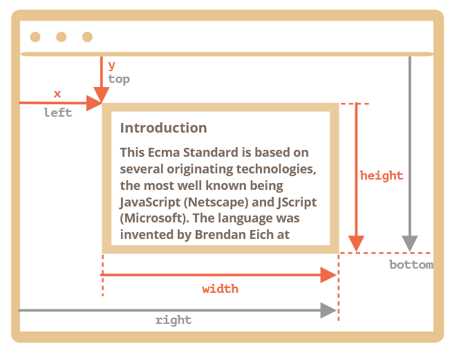

# 《现代 JavaScript 教程》 笔记


\[TOC\]

## 简介

### JavaScript 简介

#### 什么是 JavaScript？

脚本语言，浏览器端、服务器端（Node.js）、客户端（Electron）。

#### 浏览器中的 JavaScript 能做什么？

依赖于执行环境（如：[Node.js](https://wikipedia.org/wiki/Node.js) 允许 JavaScript 读写任意文件、执行网络请求等。）

浏览器中的 JavaScript 可以完成下面这些事：

* 修改网页内容和网页的样式（HTML、CSS）。
* 响应用户的行为，响应鼠标的点击或移动、键盘的敲击。
* 向远程服务器发送网络请求，下载或上传文件（所谓 \[AJAX\]\([https://en.wikipedia.org/wiki/Ajax\_\(programming](https://en.wikipedia.org/wiki/Ajax_%28programming)\)\) 和 \[COMET\]\([https://en.wikipedia.org/wiki/Comet\_\(programming](https://en.wikipedia.org/wiki/Comet_%28programming)\)\) 技术）。
* 获取或修改 cookie，向访问者提出问题、发送消息。
* 记住客户端的数据（本地存储）。

#### 浏览器中的 JavaScript 不能做什么？

* 网页中文件读写、设备访问的限制
* 不同的浏览器标签页之间基本彼此不相关。（同源策略）
* JavaScript 通过互联网可以轻松地和当前网页域名的服务器进行通讯。但是从其他网站/域名的服务器中获取数据的能力是受限的。

#### 是什么使得 JavaScript 与众不同？

* 和 HTML/CSS 完全的集成。
* 使用简单的工具完成简单的任务。
* 被所有的主流浏览器支持，并且默认开启。
* 其他：服务端、移动端、桌面端程序

#### 比 JavaScript “更好”的语言

* [CoffeeScript](http://coffeescript.org/) 是 JavaScript 的语法糖，它语法简短，明确简洁。通常使用 Ruby 的人喜欢用。
* [TypeScript](http://www.typescriptlang.org/) 将注意力集中在增加严格的数据类型。这样就能简化开发，也能用于开发复杂的系统。TypeScript 是微软开发的。
* [Flow](http://flow.org/) 也添加了数据类型，但是以一种不同的方式。由 Facebook 开发。
* [Dart](https://www.dartlang.org/) 是一门独立的语言。它拥有自己的引擎用于在非浏览器环境中运行（如：手机应用），它也能被编译成 JavaScript 。由 Google 开发。

#### 总结

* JavaScript 最开始是为浏览器设计的一门语言，但是现在也被用于很多其他的环境。
* 现在，JavaScript 是一门在浏览器中使用最广、并且能够很好集成 HTML/CSS 的语言。
* 有很多其他的语言可以被编译成 JavaScript，这些语言还提供了更多的功能。最好还是了解一下这些语言，至少在掌握了 JavaScript 之后简单地看一下。

### 手册与规范

#### 规范

* ECMA-262 规范

#### 手册

* MDN
* MSDN

#### 兼容性表

* [http://caniuse.com](http://caniuse.com) —— 每个功能都列有一个支持信息表格，例如想看哪个引擎支持现代加密（cryptography）函数：[http://caniuse.com/\#feat=cryptography。](http://caniuse.com/#feat=cryptography。)
* [https://kangax.github.io/compat-table](https://kangax.github.io/compat-table) —— 一份列有语言功能以及引擎是否支持这些功能的表格。

### 代码编辑器

VSCode

### 开发者控制台

`F12`, `Ctrl+Shift+I`

## JavaScript 基础知识

### Hello World

#### script 标签

```javascript
  <script>
    alert('Hello, world!');
  </script>
```

#### 现代标记

废弃的 `type="text/javascript"` 与 `language=…`

#### 外部脚本

```javascript
<script src="/path/to/script.js"></script>
```

* `/path/to/script.js` 从根目录开始的绝对路径
* `script.js` 当前目录下的文件
* 外部脚本优点：浏览器缓存
* 如果设置了 `src` 则 `script` 里面的内容会被忽略
* 
#### [总结](https://zh.javascript.info/hello-world#zong-jie)

* 我们可以使用一个 `<script>` 标签将 JavaScript 代码添加到页面中。
* `type` 和 `language` 特性（attribute）不是必需的。
* 外部的脚本可以通过 `<script src="path/to/script.js"></script>` 的方式插入。

### 代码结构

#### 语句

#### 分号

自动分号插入

**不建议**省略分号

#### 注释

### 现代模式

#### "use strict"

请确保 `"use strict"` 出现在脚本的最顶部，否则严格模式可能无法启用。

```javascript
alert("some code");
// 下面的 "use strict" 会被忽略，必须在最顶部。

"use strict";

// 严格模式没有被激活
```

#### [浏览器控制台](https://zh.javascript.info/strict-mode#liu-lan-qi-kong-zhi-tai)

```javascript
'use strict'; <Shift+Enter 换行>
//  ...你的代码
<按下 Enter 以运行>
```

#### [我们应该使用 “use strict” 吗？](https://zh.javascript.info/strict-mode#wo-men-ying-gai-shi-yong-usestrict-ma)

现代 JavaScript 支持 “classes” 和 “modules” —— 高级语言结构（本教程后续章节会讲到），它们会自动启用 `use strict`。因此，如果我们使用它们，则无需添加 `"use strict"` 指令。

### 变量

#### 变量

```javascript
let user = 'John', age = 25, message = 'Hello';
```

#### [变量命名](https://zh.javascript.info/variables#variable-naming)

JavaScript 的变量命名有两个限制：

1. 变量名称必须仅包含字母，数字，符号 `$` 和 `_`。
2. 首字符必须非数字。
3. 区分大小写
4. 允许非英文字母，但不推荐
5. [保留字列表](https://developer.mozilla.org/en-US/docs/Web/JavaScript/Reference/Lexical_grammar#Keywords)
6. 未采用 `use strict` 下的赋值

#### [常量](https://zh.javascript.info/variables#chang-liang)

```javascript
const myBirthday = '18.04.1982';
```

#### [大写形式的常数](https://zh.javascript.info/variables#da-xie-xing-shi-de-chang-shu)

```javascript
const COLOR_RED = "#F00";
```

#### [正确命名变量](https://zh.javascript.info/variables#zheng-que-ming-ming-bian-liang)

一些可以遵循的规则：

* 使用易读的命名，比如 `userName` 或者 `shoppingCart`。
* 离诸如 `a`、`b`、`c` 这种缩写和短名称远一点，除非你真的知道你在干什么。
* 变量名在能够准确描述变量的同时要足够简洁。不好的例子就是 `data` 和 `value`，这样的名称等于什么都没说。如果能够非常明显地从上下文知道数据和值所表达的含义，这样使用它们也是可以的。
* 脑海中的术语要和团队保持一致。如果网站的访客称为“用户”，则我们采用相关的变量命名，比如 `currentUser` 或者 `newUser`，而不要使用 `currentVisitor` 或者一个 `newManInTown`。

重用还是新建？

额外声明一个变量绝对是利大于弊的。

现代的 JavaScript 压缩器和浏览器都能够很好地对代码进行优化，所以不会产生性能问题。为不同的值使用不同的变量可以帮助引擎对代码进行优化。

#### [总结](https://zh.javascript.info/variables#zong-jie)

我们可以使用 `var`、`let` 或 `const` 声明变量来存储数据。

* `let` — 现代的变量声明方式。
* `var` — 老旧的变量声明方式。一般情况下，我们不会再使用它。但是，我们会在 [旧时的 "var"](https://zh.javascript.info/var) 章节介绍 `var` 和 `let` 的微妙差别，以防你需要它们。
* `const` — 类似于 `let`，但是变量的值无法被修改。

变量应当以一种容易理解变量内部是什么的方式进行命名。

### 数据类型

7 种原始类型和 1 种引用类型

#### Number

* 浮点数、整数
* 操作：乘法 `*`、除法 `/`、加法 `+`、减法 `-` 等等
* `Infinity`、`-Infinity` 和 `NaN`
* 数学运算是安全的（脚本永远不会因为一个致命的错误（“死亡”）而停止。最坏的情况下，我们会得到 `NaN` 的结果。）

#### [BigInt 类型](https://zh.javascript.info/types#bigint-lei-xing)

用于表示任意长度的整数。

在 JavaScript 中，“number” 类型无法表示大于 $\(2^{53}-1\)$（即 `9007199254740991`），或小于 $-\(2^{53}-1\)$ 的整数。这是其内部表示形式导致的技术限制。

#### [String 类型](https://zh.javascript.info/types#string-lei-xing)

在 JavaScript 中，有三种包含字符串的方式。

1. 双引号：`"Hello"`.
2. 单引号：`'Hello'`.
3. 反引号：```Hello``` .

反引号是 **功能扩展** 引号。它们允许我们通过将变量和表达式包装在 `${…}` 中，来将它们嵌入到字符串中。

反引号允许将字符串拆分为多行。

JavaScript 中没有 _character_ 类型。

#### [Boolean 类型（逻辑类型）](https://zh.javascript.info/types#boolean-lei-xing-luo-ji-lei-xing)

boolean 类型仅包含两个值：`true` 和 `false`。

#### [“null” 值](https://zh.javascript.info/types#null-zhi)

```javascript
let age = null;
```

相比较于其他编程语言，JavaScript 中的 `null` 不是一个“对不存在的 `object` 的引用”或者 “null 指针”。

JavaScript 中的 `null` 仅仅是一个代表“无”、“空”或“值未知”的特殊值。

上面的代码表示 `age` 是未知的。

#### [“undefined” 值](https://zh.javascript.info/types#undefined-zhi)

特殊值 `undefined` 和 `null` 一样自成类型。

`undefined` 的含义是 `未被赋值`。

如果一个变量**已被声明**，但**未被赋值**，那么它的值就是 `undefined`

从技术上讲，可以显式地将 `undefined` 赋值给变量，但是不建议这样做。通常，使用 `null` 将一个“空”或者“未知”的值写入变量中，而 `undefined` 则保留作为未进行初始化的事物的默认初始值。

#### [object 类型和 symbol 类型](https://zh.javascript.info/types#object-lei-xing-he-symbol-lei-xing)

`object` 类型是一个特殊的类型。

其他所有的数据类型都被称为“原始类型”，因为它们的值只包含一个单独的内容（字符串、数字或者其他）。相反，`object` 则用于储存数据集合和更复杂的实体。

`symbol` 类型用于创建对象的唯一标识符。我们在这里提到 `symbol` 类型是为了完整性，但我们要在学完 `object` 类型后再学习它。

#### [typeof 运算符](https://zh.javascript.info/types#type-typeof)

支持两种语法形式：

1. 作为运算符：`typeof x`。
2. 函数形式：`typeof(x)`。

`typeof null` 的结果是 `"object"`。这是官方承认的 `typeof` 的行为上的错误，这个问题来自于 JavaScript 语言的早期，并为了兼容性而保留了下来。`null` 绝对不是一个 `object`。`null` 有自己的类型，它是一个特殊值。

#### [总结](https://zh.javascript.info/types#zong-jie)

JavaScript 中有八种基本的数据类型（译注：前七种为基本数据类型，也称为原始类型，而 `object` 为复杂数据类型）。

* `number` 用于任何类型的数字：整数或浮点数，在 ±253 范围内的整数。
* `bigint` 用于任意长度的整数。
* `string` 用于字符串：一个字符串可以包含 0 个或多个字符，所以没有单独的单字符类型。
* `boolean` 用于 `true` 和 `false`。
* `null` 用于未知的值 —— 只有一个 `null` 值的独立类型。
* `undefined` 用于未定义的值 —— 只有一个 `undefined` 值的独立类型。
* `symbol` 用于唯一的标识符。
* `object` 用于更复杂的数据结构。

### 交互：alert、prompt 和 confirm

#### [alert](https://zh.javascript.info/alert-prompt-confirm#alert)

```javascript
alert("Hello");
```

#### [prompt](https://zh.javascript.info/alert-prompt-confirm#prompt)

```javascript
result = prompt(title, [default]);
```

用户取消则返回 `null`

#### [confirm](https://zh.javascript.info/alert-prompt-confirm#confirm)

```javascript
result = confirm(question);
```

`confirm` 函数显示一个带有 `question` 以及确定和取消两个按钮的模态窗口。

点击确定返回 `true`，点击取消返回 `false`。

### 类型转换

#### [字符串转换](https://zh.javascript.info/type-conversions#zi-fu-chuan-zhuan-huan)

自动转换：当我们需要一个字符串形式的值时，就会进行字符串转换。如 `alert(value)`

手动转换：**String\(value\)**

#### [数字型转换](https://zh.javascript.info/type-conversions#shu-zi-xing-zhuan-huan)

在算术函数和表达式中，会自动进行 number 类型转换。如 `"6" / "2"`

手动转换：**Number\(value\)**

转换失败：`NaN`

溢出：`Infinity` `-Infinity`

#### [布尔型转换](https://zh.javascript.info/type-conversions#bu-er-xing-zhuan-huan)

自动转换：逻辑运算

手动转换：**Boolean\(value\)**

#### [总结](https://zh.javascript.info/type-conversions#zong-jie)

有三种常用的类型转换：转换为 string 类型、转换为 number 类型和转换为 boolean 类型。

**字符串转换** —— 转换发生在输出内容的时候，也可以通过 `String(value)` 进行显式转换。原始类型值的 string 类型转换通常是很明显的。

**数字型转换** —— 转换发生在进行算术操作时，也可以通过 `Number(value)` 进行显式转换。

数字型转换遵循以下规则：

| 值 | 变成…… |
| :--- | :--- |
| `undefined` | `NaN` |
| `null` | `0` |
| `true / false` | `1 / 0` |
| `string` | “按原样读取”字符串，两端的空白会被忽略。空字符串变成 `0`。转换出错则输出 `NaN`。 |

**布尔型转换** —— 转换发生在进行逻辑操作时，也可以通过 `Boolean(value)` 进行显式转换。

布尔型转换遵循以下规则：

| 值 | 变成…… |
| :--- | :--- |
| `0`, `null`, `undefined`, `NaN`, `""` | `false` |
| 其他值 | `true` |

上述的大多数规则都容易理解和记忆。人们通常会犯错误的值得注意的例子有以下几个：

* 对 `undefined` 进行数字型转换时，输出结果为 `NaN`，而非 `0`。
* 对 `"0"` 和只有空格的字符串（比如：`" "`）进行布尔型转换时，输出结果为 `true`。

### Basic operators, maths

#### [术语：“一元运算符”，“二元运算符”，“运算元”](https://zh.javascript.info/operators#shu-yu-yi-yuan-yun-suan-fu-er-yuan-yun-suan-fu-yun-suan-yuan)

#### [Maths](https://zh.javascript.info/operators#maths)

支持的数学运算：

* Addition `+`,
* Subtraction `-`,
* Multiplication `*`,
* Division `/`,
* Remainder `%`,
* Exponentiation `**`.

#### [String concatenation with binary +](https://zh.javascript.info/operators#stringconcatenationwithbinary)

只要任意一个运算元是字符串，那么另一个运算元也将被转化为字符串.

但是注意，运算是按顺序来的：

```javascript
alert(2 + 2 + '1' ); // "41" and not "221"
```

#### [数字转化，一元运算符 +](https://zh.javascript.info/operators#shu-zi-zhuan-hua-yi-yuan-yun-suan-fu)

加号 `+` 应用于单个值，如果运算元不是数字，加号 `+` 则会将其转化为数字

#### [运算符优先级](https://zh.javascript.info/operators#yun-suan-fu-you-xian-ji)

一元运算符 &gt; 二元运算符

#### [赋值运算符](https://zh.javascript.info/operators#fu-zhi-yun-suan-fu)

**Assignment = returns a value**

**链式赋值**

**原地赋值 op=**

**自增自减**

前置 `++value` `--value`

后置 `value++` `value--`

#### [位运算符](https://zh.javascript.info/operators#wei-yun-suan-fu)

* 按位与 \( `&` \)
* 按位或 \( `|` \)
* 按位异或 \( `^` \)
* 按位非 \( `~` \)
* 左移 \( `<<` \)
* 右移 \( `>>` \)
* 无符号右移 \( `>>>` \)

#### [逗号运算符](https://zh.javascript.info/operators#dou-hao-yun-suan-fu)

逗号运算符能让我们处理多个语句，使用 `,` 将它们分开。每个语句都运行了，但是只有最后的语句的结果会被返回。

```javascript
let a = (1 + 2, 3 + 4);

alert( a ); // 7（3 + 4 的结果）
```

### 值的比较

#### [比较结果为 Boolean 类型](https://zh.javascript.info/comparison#bi-jiao-jie-guo-wei-boolean-lei-xing)

#### [字符串比较](https://zh.javascript.info/comparison#zi-fu-chuan-bi-jiao)

“字典（dictionary）”或“词典（lexicographical）”序

非真正的字典顺序，而是 Unicode 编码顺序

#### [不同类型间的比较](https://zh.javascript.info/comparison#bu-tong-lei-xing-jian-de-bi-jiao)

当数字_（注：原文没）_对不同类型的值进行比较时，JavaScript 会首先将其转化为数字（number）再判定大小。

#### [严格相等](https://zh.javascript.info/comparison#yan-ge-xiang-deng)

**严格**相等运算符 `===` 在进行比较时不会做任何的类型转换。

```javascript
alert( null === undefined ); // false
alert( null == undefined ); // true
```

#### [奇怪的结果：null vs 0](https://zh.javascript.info/comparison#qi-guai-de-jie-guo-nullvs0)

```javascript
alert( null > 0 );  // (1) false
alert( null == 0 ); // (2) false
alert( null >= 0 ); // (3) true
```

相等性检查 `==` 和普通比较符 `> < >= <=` 的代码逻辑是相互独立的。进行值的比较时，`null` 会被转化为数字，因此它被转化为了 `0`。这就是为什么（3）中 `null >= 0` 返回值是 true，（1）中 `null > 0` 返回值是 false。

#### [特立独行的 undefined](https://zh.javascript.info/comparison#te-li-du-hang-de-undefined)

`undefined` 只与 `null` 相等（`==`），不会与其他值相等

#### [避免问题](https://zh.javascript.info/comparison#bi-mian-wen-ti)

我们为何要研究上述示例？我们需要时刻记得这些古怪的规则吗？不，其实不需要。虽然随着代码写得越来越多，我们对这些规则也都会烂熟于胸，但是我们需要更为可靠的方法来避免潜在的问题：

* 除了严格相等 `===` 外，其他但凡是有 `undefined/null` 参与的比较，我们都需要格外小心。
* 除非你非常清楚自己在做什么，否则永远不要使用 `>= > < <=` 去比较一个可能为 `null/undefined` 的变量。对于取值可能是 `null/undefined` 的变量，请按需要分别检查它的取值情况。

#### [总结](https://zh.javascript.info/comparison#zong-jie)

* 比较运算符始终返回布尔值。
* 字符串的比较，会按照“词典”顺序逐字符地比较大小。
* 当对不同类型的值进行比较时，它们会先被转化为数字（不包括严格相等检查）再进行比较。
* 在非严格相等 `==` 下，`null` 和 `undefined` 相等且各自不等于任何其他的值。
* 在使用 `>` 或 `<` 进行比较时，需要注意变量可能为 `null/undefined` 的情况。比较好的方法是单独检查变量是否等于 `null/undefined`。

### 条件运算符：if 和 '?'

#### [“if” 语句](https://zh.javascript.info/ifelse#if-yu-ju)

#### [布尔转换](https://zh.javascript.info/ifelse#bu-er-zhuan-huan)

#### [“else” 语句](https://zh.javascript.info/ifelse#else-yu-ju)

#### [多个条件：“else if”](https://zh.javascript.info/ifelse#duo-ge-tiao-jian-elseif)

#### [条件运算符 ‘?’](https://zh.javascript.info/ifelse#tiao-jian-yun-suan-fu)

#### [多个 ‘?’](https://zh.javascript.info/ifelse#duo-ge)

#### [‘?’ 的非常规使用](https://zh.javascript.info/ifelse#de-fei-chang-gui-shi-yong)

**不建议**，眼睛垂直阅读代码，而这样不好理解

```javascript
(company == 'Netscape') ?
   alert('Right!') : alert('Wrong.');
```

### 逻辑运算符

#### [\|\|（或）](https://zh.javascript.info/logical-operators#huo)

[或运算寻找第一个真值](https://zh.javascript.info/logical-operators#huo-yun-suan-xun-zhao-di-yi-ge-zhen-zhi)

#### [&&（与）](https://zh.javascript.info/logical-operators#yu)

[与操作寻找第一个假值](https://zh.javascript.info/logical-operators#yu-cao-zuo-xun-zhao-di-yi-ge-jia-zhi)

#### [!（非）](https://zh.javascript.info/logical-operators#fei)

优先级 `！`， `||`， `&&`

### Nullish coalescing operator '??'

空值（`null`, `undefined`）合并运算符

`||` 寻找第一个真值，`??` 寻找第一个定义值

### 运算符优先级

[MDN: Operator\_Precedence](https://developer.mozilla.org/en-US/docs/Web/JavaScript/Reference/Operators/Operator_Precedence#Table)

### 循环：while 和 for

#### [“while” 循环](https://zh.javascript.info/while-for#while-xun-huan)

#### [“do…while” 循环](https://zh.javascript.info/while-for#dowhile-xun-huan)

#### [“for” 循环](https://zh.javascript.info/while-for#for-xun-huan)

[省略语句段](https://zh.javascript.info/while-for#sheng-lve-yu-ju-duan)

#### [跳出循环](https://zh.javascript.info/while-for#tiao-chu-xun-huan)

`break`

#### [继续下一次迭代](https://zh.javascript.info/while-for#continue)

`continue`

禁止 `break/continue` 在 ‘?’ 的右边

#### [break/continue 标签](https://zh.javascript.info/while-for#breakcontinue-biao-qian)

```javascript
outer: for (...) {
    for (...) {
        ...
    }
}
```

`break outer` 向上寻找名为 `outer` 的标签并跳出当前循环

`continue` 执行跳转到标记循环的下一次迭代。

### "switch" 语句

#### [语法](https://zh.javascript.info/switch#yu-fa)

**严格**比较

```javascript
switch(x) {
  case 'value1':  // if (x === 'value1')
    ...
    [break]

  case 'value2':  // if (x === 'value2')
    ...
    [break]

  default:
    ...
    [break]
}
```

### 函数

#### [函数声明](https://zh.javascript.info/function-basics#han-shu-sheng-ming)

* 局部变量
* 外部变量
* 参数
  * 被省略的参数的值为 `undefined`
  * 默认值
  * 默认值可以是值或者表达式

```javascript
function showMessage(from, text = anotherFunction()) {
  // anotherFunction() 仅在没有给定 text 时执行
  // 其运行结果将成为 text 的值
}
```

* 返回值
  * 空值的 return 或没有 return 的函数返回值为 undefined
  * ⚡不要在 `return` 与返回值之间添加新行

```javascript
return
 (some + long + expression + or + whatever * f(a) + f(b))
```

会被自动补全`;`

```javascript
return;
 (some + long + expression + or + whatever * f(a) + f(b))
```

#### [函数命名](https://zh.javascript.info/function-basics#function-naming)

* 函数就是行为（action）。所以它们的名字通常是动词。
* 尽可能简短准确
* 一个函数 —— 一个行为

#### [函数 == 注释](https://zh.javascript.info/function-basics#han-shu-zhu-shi)

**自描述**代码，代码结构、可读性强的重要性

### 函数表达式

#### 语法

注意**分号**

```javascript
let sayHi = function() {
  alert( "Hello" );
};
```

#### [回调函数](https://zh.javascript.info/function-expressions#hui-tiao-han-shu)

#### [函数表达式 vs 函数声明](https://zh.javascript.info/function-expressions#han-shu-biao-da-shi-vs-han-shu-sheng-ming)

* 语法
* JavaScript 引擎何时创建函数
  * 在函数声明被定义之前，它就可以被调用。
  * 函数表达式是在代码执行到达时被创建，并且仅从那一刻起可用。
  * 严格模式下，当一个函数声明在一个代码块内时，它在该代码块内的任何位置都是可见的。但在代码块外不可见。（使用函数表达式可以让函数在块外可见）
* 选择
  * 优先函数声明
    * 能够为组织代码提供更多的灵活性。因为我们可以在声明这些函数之前调用这些函数。
    * 可读性更好，更醒目
  * 否则，有需求下，函数表达式

#### [总结](https://zh.javascript.info/function-expressions#zong-jie)

* 函数是值。它们可以在代码的任何地方被分配，复制或声明。
* 如果函数在主代码流中被声明为单独的语句，则称为“函数声明”。
* 如果该函数是作为表达式的一部分创建的，则称其“函数表达式”。
* 在执行代码块之前，内部算法会先处理函数声明。所以函数声明在其被声明的代码块内的任何位置都是可见的。
* 函数表达式在执行流程到达时创建。

### 箭头函数，基础知识

#### [总结](https://zh.javascript.info/arrow-functions-basics#zong-jie)

对于一行代码的函数来说，箭头函数是相当方便的。它具体有两种：

1. 不带花括号：`(...args) => expression` — 右侧是一个表达式：函数计算表达式并返回其结果。
2. 带花括号：`(...args) => { body }` — 花括号允许我们在函数中编写多个语句，但是我们需要显式地 `return` 来返回一些内容。

### JavaScript 特性

（本章小结）

* 代码结构
* 严格模式
* 变量（7+1种类型）
* 交互（浏览器）
* 运算符
* 循环（3种）
* switch
* 函数

## 代码质量

### [在 Chrome 中调试](https://zh.javascript.info/debugging-chrome)

#### “资源（Sources）”面板

#### 控制台（Console）

#### 断点（Breakpoints）

#### Debugger 命令

```javascript
function hello(name) {
  let phrase = `Hello, ${name}!`;

  debugger;  // <-- 调试器会在这停止

  say(phrase);
}
```

#### 暂停并查看

* 察看（Watch） —— 显示任意表达式的当前值。
* 调用栈（Call Stack）
* 作用域（Scope） —— 显示当前的变量。

#### 跟踪执行

`Step` 与 `Step into` 的区别

异步函数调用情况下表现不同，“下一步（Step）”命令会忽略异步行为，例如 `setTimeout`（计划的函数调用），它会过一段时间再执行。而“步入（Step into）”会进入到代码中并等待（如果需要）。

#### 总结

3 种方式来暂停一个脚本：

1. 一个断点。
2. `debugger` 语句。
3. 一个错误（如果开发者工具是打开状态，并且按钮  `Pause on exception`是开启的状态）。

### [代码风格](https://zh.javascript.info/coding-style)

* 清晰
* 易读
* 团队协作

#### [风格指南](https://zh.javascript.info/coding-style#feng-ge-zhi-nan)

一些受欢迎的选择：

* [Google JavaScript 风格指南](https://google.github.io/styleguide/jsguide.html)
* [Airbnb JavaScript 风格指南](https://github.com/airbnb/javascript)
* [Idiomatic.JS](https://github.com/rwaldron/idiomatic.js)
* [StandardJS](https://standardjs.com/)
* 还有很多……

#### [自动检查器](https://zh.javascript.info/coding-style#zi-dong-jian-cha-qi)

* [JSLint](http://www.jslint.com/) — 第一批检查器之一。
* [JSHint](http://www.jshint.com/) — 比 JSLint 多了更多设置。
* [ESLint](http://eslint.org/) — 应该是最新的一个。

### [注释](https://zh.javascript.info/comments)

为什么任务以这种方式解决？代码有哪些巧妙的特性？它们被用在了什么地方？

如果代码存在任何巧妙和不显而易见的方法，那绝对需要注释。

#### [总结](https://zh.javascript.info/comments#zong-jie)

一个好的开发者的标志之一就是他的注释：their presence and even their absence.（译注：在该注释的地方注释，在不需要注释的地方则不注释，甚至写得好的自描述函数本身就是一种注释）。

好的注释可以使我们更好地维护代码，一段时间之后依然可以更高效地回到代码高效开发。

**注释这些内容：**

* 整体架构，高层次的观点。
* 函数的用法。
* 重要的解决方案，特别是在不是很明显时。

**避免注释：**

* 描述“代码如何工作”和“代码做了什么”。
* 避免在代码已经足够简单或代码有很好的自描述性而不需要注释的情况下，还写些没必要的注释。

注释也被用于一些如 JSDoc3 等文档自动生成工具：他们读取注释然后生成 HTML 文档（或者其他格式的文档）。

### [忍者代码](https://zh.javascript.info/ninja-code)

……

### [使用 Mocha 进行自动化测试](https://zh.javascript.info/testing-mocha)

#### [为什么我们需要测试？](https://zh.javascript.info/testing-mocha#wei-shi-mo-wo-men-xu-yao-ce-shi)

当通过手动重新运行来测试代码时，很容易漏掉一些东西。

自动化测试意味着测试是独立于代码的。它们以各种方式运行我们的函数，并将结果与预期结果进行比较。

#### [行为驱动开发（BDD）](https://zh.javascript.info/testing-mocha#hang-wei-qu-dong-kai-fa-bdd)

BDD 包含了三部分内容：测试、文档和示例。

在 BDD 中，规范先行，实现在后。最后我们同时拥有了规范和代码。

1. 作为 **测试** —— 保证代码正确工作。
2. 作为 **文档** —— `describe` 和 `it` 的标题告诉我们函数做了什么。
3. 作为 **案例** —— 测试实际工作的例子展示了一个函数可以被怎样使用。

#### [开发流程](https://zh.javascript.info/testing-mocha#kai-fa-liu-cheng)

开发流程通常看起来像这样：

1. 编写初始规范，测试最基本的功能。
2. 创建一个最初始的实现。
3. 检查它是否工作，我们运行测试框架 [Mocha](http://mochajs.org/)（很快会有更多细节）来运行测试。当功能未完成时，将显示错误。我们持续修正直到一切都能工作。
4. 现在我们有一个带有测试的能工作的初步实现。
5. 我们增加更多的用例到规范中，或许目前的程序实现还不支持。无法通过测试。
6. 回到第 3 步，更新程序直到测试不会抛出错误。
7. 重复第 3 步到第 6 步，直到功能完善。

测试工具

* [Mocha](http://mochajs.org/) —— 核心框架：提供了包括通用型测试函数 `describe` 和 `it`，以及用于运行测试的主函数。
* [Chai](http://chaijs.com) —— 提供很多断言（assertion）支持的库。它提供了很多不同的断言，现在我们只需要用 `assert.equal`。
* [Sinon](http://sinonjs.org/) —— 用于监视函数、模拟内置函数和其他函数的库，我们在后面才会用到它。

注意：

* 保持测试之间独立，有助于我们获知代码中正在发生什么
* 一个测试检查一个东西

#### [嵌套描述](https://zh.javascript.info/testing-mocha#qian-tao-miao-shu)

使用嵌套的 `describe` 来进行分组

```javascript
describe("pow", function() {

  describe("raises x to power 3", function() {

    function makeTest(x) {
      let expected = x * x * x;
      it(`${x} in the power 3 is ${expected}`, function() {
        assert.equal(pow(x, 3), expected);
      });
    }

    for (let x = 1; x <= 5; x++) {
      makeTest(x);
    }

  });

  // ……可以在这里写更多的测试代码，describe 和 it 都可以添加在这。
});
```

#### 其它

📌`before`/`after` 和 `beforeEach`/`afterEach`

```javascript
describe("test", function() {

  before(() => alert("Testing started – before all tests"));
  after(() => alert("Testing finished – after all tests"));

  beforeEach(() => alert("Before a test – enter a test"));
  afterEach(() => alert("After a test – exit a test"));

  it('test 1', () => alert(1));
  it('test 2', () => alert(2));

});
```

可以通过编写 `it.only` 而不是 `it` 来隔离单个测试，并以独立模式运行它

```javascript
describe("Raises x to power n", function() {
  it("5 in the power of 1 equals 5", function() {
    assert.equal(pow(5, 1), 5);
  });

  // Mocha 将只运行这个代码块
  it.only("5 in the power of 2 equals 25", function() {
    assert.equal(pow(5, 2), 25);
  });

  it("5 in the power of 3 equals 125", function() {
    assert.equal(pow(5, 3), 125);
  });
});
```

#### [总结](https://zh.javascript.info/testing-mocha#zong-jie)

如果没有测试，一般有两个办法：

1. 展示修改，无论修改了什么。然后我们的用户遇到了 bug，这应该是我们没有手动完成某些检查。
2. 如果对出错的惩罚比较严重，并且没有测试，那么大家会很害怕修改这样的函数，然后这些代码就会越来越陈旧，没有人会想接触它。这很不利于发展。

**自动化测试则有助于避免这样的问题！**

如果这个项目被测试代码覆盖了，就不会出现这种问题。在任何修改之后，我们都可以运行测试，并在几秒钟内看到大量的检查。

**另外，一个经过良好测试的代码通常都有更好的架构。**

当然，这是因为覆盖了自动化测试的代码更容易修改和改进。但还有另一个原因。

要编写测试，代码的组织方式应确保每个函数都有一个清晰描述的任务、定义良好的输入和输出。这意味着从一开始就有一个好的架构。

在实际开发中有时候可能并不容易，有时很难在写实际代码之前编写规范，因为还不清楚它应该如何表现。但一般来说，编写测试使得开发更快更稳定。

### [Polyfill](https://zh.javascript.info/polyfills)

#### [Babel](https://zh.javascript.info/polyfills#babel)

当我们使用语言的一些现代特性时，一些引擎可能无法支持这样的代码。但并不是所有功能在任何地方都有实现，这就是 Babel 要解决的问题。

[Babel](https://babeljs.io) 是一个 [transpiler](https://en.wikipedia.org/wiki/Source-to-source_compiler)。它将现代的 JavaScript 代码转化为以前的标准形式。Babel 包含两个部分:

1. transpiler, 用于重写的代码
2. polyfill, 用于实现新的内建函数

## [Object（对象）：基础知识](https://zh.javascript.info/object-basics)

#### 对象

创建

```javascript
let user = new Object(); // “构造函数” 的语法
let user = {};  // “字面量” 的语法
```

移除属性

```javascript
delete user.age;
```

可以用多字词语来作为属性名，但必须给它们加上引号

```javascript
let user = {
  name: "John",
  age: 30,
  "likes birds": true  // 多词属性名必须加引号，访问时则使用 user["likes birds"]
};
```

列表中的最后一个属性建议以逗号结尾：

```javascript
let user = {
  name: "John",
  age: 30,
}
```

这叫做尾随（trailing）或悬挂（hanging）逗号。这样便于我们添加、删除和移动属性，因为所有的行都是相似的。

使用 const 声明的对象是可以被修改的

```javascript
const user = {
  name: "John"
};

user.name = "Pete"; // (*)

alert(user.name); // Pete
```

方括号

```javascript
let key = "likes birds";

// 跟 user["likes birds"] = true; 一样
user[key] = true;
```

变量 `key` 可以是程序运行时计算得到的，而点符号则不行

```javascript
let user = {
  name: "John",
  age: 30
};

let key = "name";
alert( user.key ) // undefined
```

#### [计算属性](https://zh.javascript.info/object#ji-suan-shu-xing)

```javascript
let fruit = prompt("Which fruit to buy?", "apple");

let bag = {
  [fruit]: 5, // 属性名是从 fruit 变量中得到的
};

alert( bag.apple ); // 5 如果 fruit="apple"
```

计算属性的含义很简单：`[fruit]` 含义是属性名应该从 `fruit` 变量中获取。

我们可以在方括号中使用更复杂的表达式：

```javascript
let fruit = 'apple';
let bag = {
  [fruit + 'Computers']: 5 // bag.appleComputers = 5
};
```

#### [属性值简写](https://zh.javascript.info/object#shu-xing-zhi-jian-xie)

```javascript
function makeUser(name, age) {
  return {
    name, // 与 name: name 相同
    age,  // 与 age: age 相同
    // ...
  };
}
```

#### [属性名称限制](https://zh.javascript.info/object#shu-xing-ming-cheng-xian-zhi)

属性命名没有限制。属性名可以是任何字符串（`包括保留字`）或者 `symbol`，其他类型会被自动地转换为字符串。

例如，当数字 `0` 被用作对象的属性的键时，会被转换为字符串 `"0"`：

```javascript
let obj = {
  0: "test" // 等同于 "0": "test"
};

// 都会输出相同的属性（数字 0 被转为字符串 "0"）
alert( obj["0"] ); // test
alert( obj[0] ); // test (相同的属性)
```

这里有个小陷阱：一个名为 `__proto__` 的属性。我们不能将它设置为一个非对象的值：

```javascript
let obj = {};
obj.__proto__ = 5; // 分配一个数字
alert(obj.__proto__); // [object Object] — 值为对象，与预期结果不同
```

#### [属性存在性测试，“in” 操作符](https://zh.javascript.info/object#shu-xing-cun-zai-xing-ce-shi-in-cao-zuo-fu)

注意 JavaScript 能够被访问任何属性。即使属性不存在也不会报错！

```javascript
let user = {};

alert( user.noSuchProperty === undefined ); // true 意思是没有这个属性
```

或者使用 `in`

```javascript
"key" in object
```

注意，`in` 的左边必须是 **属性名**，通常是一个带引号的字符串，省略引号则表示一个字符串，

大部分情况下与 `undefined` 进行比较来判断就可以了，除非属性存在，但存储的值是 `undefined`（通常会用 `null` 来表示未知的或者空的值）

```javascript
let obj = {
  test: undefined
};

alert( obj.test ); // 显示 undefined，所以属性不存在？

alert( "test" in obj ); // true，属性存在！
```

#### [“for…in” 循环](https://zh.javascript.info/object#forin-xun-huan)

```javascript
for (key in object) {
  // 对此对象属性中的每个键执行的代码
}
```

[Ordered like an object](https://javascript.info/object#ordered-like-an-object)

整数属性会被进行排序，其他属性则按照创建的顺序显示。

```javascript
let codes = {
  "49": "Germany",
  "41": "Switzerland",
  "44": "Great Britain",
  // ..,
  "1": "USA"
};

for(let code in codes) {
  alert(code); // 1, 41, 44, 49
}
```

这里的“整数属性”指的是一个可以在不做任何更改的情况下与一个整数进行相互转换的字符串。

所以，“49” 是一个整数属性名，因为我们把它转换成整数，再转换回来，它还是一样的。但是 “+49” 和 “1.2” 就不行了

```javascript
// Math.trunc 是内置的去除小数部分的方法。
alert( String(Math.trunc(Number("49"))) ); // "49"，相同，整数属性
alert( String(Math.trunc(Number("+49"))) ); // "49"，不同于 "+49" ⇒ 不是整数属性
alert( String(Math.trunc(Number("1.2"))) ); // "1"，不同于 "1.2" ⇒ 不是整数属性
```

```javascript
let codes = {
  "+49": "Germany",
  "+41": "Switzerland",
  "+44": "Great Britain",
  // ..,
  "+1": "USA"
};

for (let code in codes) {
  alert( +code ); // 49, 41, 44, 1
}
```

#### [总结](https://zh.javascript.info/object#zong-jie)

对象是具有一些特殊特性的关联数组。它们存储属性（键值对）。

这一章学习的叫做“普通对象（plain object）”，或者就叫对象。

后面会学到，“Array 类型”或“Date 类型”，但其实它们并不是自身所属的类型，而是属于一个对象类型即 “object”。它们以不同的方式对 “object” 做了一些扩展。

### [对象拷贝，引用](https://zh.javascript.info/object-copy)

对象与原始类型其中一个基本的区别是：对象“通过引用的形式”被存储和拷贝。

原始类型值：字符串，数字，布尔值 —— 被“作为整体”赋值/拷贝。

#### [通过引用来比较](https://zh.javascript.info/object-copy#tong-guo-yin-yong-lai-bi-jiao)

对于对象来说，普通相等 `==` 和严格相等 `===` 是两个作用结果完全一样的运算符。

**仅当两个对象为同一对象时，两者才相等。**

#### [克隆与合并，Object.assign](https://zh.javascript.info/object-copy#ke-long-yu-he-bing-objectassign)

```javascript
let user = {
  name: "John",
  age: 30
};

let clone = {}; // 新的空对象

// 将 user 中所有的属性拷贝到其中
for (let key in user) {
  clone[key] = user[key];
}

// 现在 clone 是带有相同内容的完全独立的对象
clone.name = "Pete"; // 改变了其中的数据

alert( user.name ); // 原来的对象中的 name 属性依然是 John
```

[Object.assign](https://developer.mozilla.org/zh/docs/Web/JavaScript/Reference/Global_Objects/Object/assign)

```javascript
Object.assign(dest, [src1, src2, src3...])
```

例如：

```javascript
let user = { name: "John" };

let permissions1 = { canView: true };
let permissions2 = { canEdit: true };

// 将 permissions1 和 permissions2 中的所有属性都拷贝到 user 中
Object.assign(user, permissions1, permissions2);

// 现在 user = { name: "John", canView: true, canEdit: true }
```

被拷贝的属性的属性名已经存在，那么它会被覆盖

```javascript
let user = { name: "John" };

Object.assign(user, { name: "Pete" });

alert(user.name); // 现在 user = { name: "Pete" }
```

#### [深层克隆](https://zh.javascript.info/object-copy#shen-ceng-ke-long)

有一个标准的深拷贝算法，它不仅能处理上面的例子，还能应对更多复杂的情况，它被称为 [结构化拷贝算法](https://html.spec.whatwg.org/multipage/structured-data.html#safe-passing-of-structured-data)。

我们可以用递归来实现。或者不自己造轮子，使用现成的实现，例如 JavaScript 库 [lodash](https://lodash.com) 中的 [\_.cloneDeep\(obj\)](https://lodash.com/docs#cloneDeep)。

#### [总结](https://zh.javascript.info/object-copy#zong-jie)

对象通过引用被赋值和拷贝。换句话说，一个变量存储的不是“对象的值”，而是一个对值的“引用”（内存地址）。因此，拷贝此类变量或将其作为函数参数传递时，所拷贝的是引用，而不是对象本身。

所有通过被拷贝的引用的操作（如添加、删除属性）都作用在同一个对象上。

为了创建“真正的拷贝”（一个克隆），我们可以使用 `Object.assign` 来做所谓的“浅拷贝”（嵌套对象被通过引用进行拷贝）或者使用“深拷贝”函数，例如 [\_.cloneDeep\(obj\)](https://lodash.com/docs#cloneDeep)。

### [垃圾回收](https://zh.javascript.info/garbage-collection)

#### [可达性（Reachability）](https://zh.javascript.info/garbage-collection#ke-da-xing-reachability)

从根（**roots**）出发

* 当前函数的局部变量和参数。
* 嵌套调用时，当前调用链上所有函数的变量与参数。
* 全局变量。
* （还有一些内部的）

#### [内部算法](https://zh.javascript.info/garbage-collection#nei-bu-suan-fa)

基本算法 “mark-and-sweep”

定期执行以下“垃圾回收”步骤：

* 垃圾收集器找到所有的根，并“标记”（记住）它们。
* 然后它遍历并“标记”来自它们的所有引用。
* 然后它遍历标记的对象并标记 **他们的** 引用。所有被遍历到的对象都会被记住，以免将来再次遍历到同一个对象。
* ……如此操作，直到所有可达的（从根部）引用都被访问到。
* 没有被标记的对象都会被删除。

优化

* **分代收集（Generational collection）**—— 对象被分成两组：“新的”和“旧的”。许多对象出现，完成他们的工作并很快死去，他们可以很快被清理。那些长期存活的对象会变得“老旧”，而且被检查的频次也会减少。
* **增量收集（Incremental collection）**——  如果有许多对象，并且我们试图一次遍历并标记整个对象集，则可能需要一些时间，并在执行过程中带来明显的延迟。所以引擎试图将垃圾收集工作分成几部分来做。然后将这几部分会逐一进行处理。这需要他们之间有额外的标记来追踪变化，但是这样会有许多微小的延迟而不是一个大的延迟。
* **闲时收集（Idle-time collection）**—— 垃圾收集器只会在 CPU 空闲时尝试运行，以减少可能对代码执行的影响。
* 等等

#### [总结](https://zh.javascript.info/garbage-collection#zong-jie)

主要需要掌握的内容：

* 垃圾回收是自动完成的，我们不能强制执行或是阻止执行。
* 当对象是可达状态时，它一定是存在于内存中的。
* 被引用与可访问（从一个根）不同：一组相互连接的对象可能整体都不可达。

推荐 《The Garbage Collection Handbook: The Art of Automatic Memory Management》（R. Jones 等人著）。

### [对象方法，"this"](https://zh.javascript.info/object-methods)

面向对象编程：当我们在代码中用对象表示实体时，就是所谓的 [面向对象编程](https://en.wikipedia.org/wiki/Object-oriented_programming)，简称为 “OOP”。

#### 方法示例

```javascript
let user = {
  name: "John",
  age: 30
};

user.sayHi = function() {
  alert("Hello!");
};

user.sayHi(); // Hello!
```

#### [方法简写](https://zh.javascript.info/object-methods#fang-fa-jian-xie)

```javascript
// 这些对象作用一样

user = {
  sayHi: function() {
    alert("Hello");
  }
};

// 方法简写看起来更好，对吧？
let user = {
  sayHi() { // 与 "sayHi: function()" 一样
    alert("Hello");
  }
};
```

这种表示法还是有些不同。在对象继承方面有一些细微的差别（稍后将会介绍），但目前它们并不重要。在几乎所有的情况下，较短的语法是首选的。

#### [方法中的 “this”](https://zh.javascript.info/object-methods#fang-fa-zhong-de-this)

作用：在方法中访问当前对象

```javascript
let user = {
  name: "John",
  age: 30,

  sayHi() {
    // "this" 指的是“当前的对象”
    alert(this.name);
  }

};

user.sayHi(); // John
```

#### [“this” 不受限制](https://zh.javascript.info/object-methods#this-bu-shou-xian-zhi)

在 JavaScript 中，`this` 关键字与其他大多数编程语言中的不同。JavaScript 中的 `this` 可以用于任何函数。`this` 的值是在代码运行时计算出来的，它取决于代码上下文。

在没有对象的情况下调用时，`this == undefined`。在非严格模式的情况下，`this` 将会是 **全局对象**（浏览器中的 `window`，我们稍后会在 [全局对象](https://zh.javascript.info/global-object) 一章中学习它）。这是一个历史行为，`"use strict"` 已经将其修复了。

#### [箭头函数没有自己的 “this”](https://zh.javascript.info/object-methods#jian-tou-han-shu-mei-you-zi-ji-de-this)

箭头函数中的 `this` 值取决于外部“正常的”函数。

#### [总结](https://zh.javascript.info/object-methods#zong-jie)

* 存储在对象属性中的函数被称为“方法”。
* 方法允许对象进行像 `object.doSomething()` 这样的“操作”。
* 方法可以将对象引用为 `this`。

`this` 的值是在程序运行时得到的。

* 一个函数在声明时，可能就使用了 `this`，但是这个 `this` 只有在函数被调用时才会有值。
* 可以在对象之间复制函数。
* 以“方法”的语法调用函数时：`object.method()`，调用过程中的 `this` 值是 `object`。

请注意箭头函数有些特别：它们没有 `this`。在箭头函数内部访问到的 `this` 都是从外部获取的。

### [构造器和操作符 "new"](https://zh.javascript.info/constructor-new)

常规的 `{...}` 语法允许创建一个对象。需要创建许多类似的对象时，可以使用构造函数和 `"new"` 操作符来实现。构造器的主要目的即实现可重用的对象创建代码。

#### [构造函数](https://zh.javascript.info/constructor-new#gou-zao-han-shu)

构造函数在技术上是常规函数。不过有两个约定：

1. 它们的命名以大写字母开头。
2. 它们只能由 `"new"` 操作符来执行。

虽然 `new Ctor` 等同于 `new Ctor()`，但前者不被认为是一种好的风格。

当一个函数被使用 `new` 操作符执行时，它按照以下步骤：

1. 一个新的空对象被创建并分配给 `this`。
2. 函数体执行。通常它会修改 `this`，为其添加新的属性。
3. 返回 `this` 的值。

换句话说，`new User(...)` 做的就是类似的事情：

```javascript
function User(name) {
  // this = {};（隐式创建）

  // 添加属性到 this
  this.name = name;
  this.isAdmin = false;

  // ……用于用户创建的其他代码
  // 也许是复杂的逻辑和语句
  // 局部变量等

  // return this;（隐式返回）
}
```

#### [构造器模式测试：new.target](https://zh.javascript.info/constructor-new#gou-zao-qi-mo-shi-ce-shi-newtarget)

（少用）

在一个函数内部，我们可以使用 `new.target` 属性来检查它是否被使用 `new` 进行调用了。

```javascript
// 不带 "new"：
User(); // new.target => undefined

// 带 "new"：
new User(); // new.target => function User { ... }
```

可以让 `new` 调用和常规调用做相同的工作，像这样：

```javascript
function User(name) {
  if (!new.target) { // 如果你没有通过 new 运行我
    return new User(name); // ……我会给你添加 new
  }

  this.name = name;
}

let john = User("John"); // 将调用重定向到新用户
alert(john.name); // John
```

#### [构造器的 return](https://zh.javascript.info/constructor-new#gou-zao-qi-de-return)

* 通常，构造器没有 `return` 语句。它们的任务是将所有必要的东西写入 `this`，并自动转换为结果。
* 如果 `return` 返回的是一个对象，则返回这个对象，而不是 `this`。
* 如果 `return` 返回的是一个原始类型，则忽略。

#### [构造器中的方法](https://zh.javascript.info/constructor-new#gou-zao-qi-zhong-de-fang-fa)

```javascript
function User(name) {
  this.name = name;

  this.sayHi = function() {
    alert( "My name is: " + this.name );
  };
}
```

#### [总结](https://zh.javascript.info/constructor-new#zong-jie)

* 构造函数，或简称构造器，就是常规函数，但大家对于构造器有个共同的约定，就是其命名**首字母要大写**。
* 构造函数只能使用 **`new`** 来调用。这样的调用意味着在开始时创建了空的 `this`，并在最后返回填充了值的 `this`。

### [可选链 "?."](https://zh.javascript.info/optional-chaining)

`?.` 检查左边部分是否为 `null/undefined`，如果不是则继续运算。语法：`obj?.xxx`。

可选链 `?.` 不是一个运算符，而是一个特殊的语法结构。它还可以与函数和方括号一起使用。即 `method?.()`，`obj?.[prop]` 。

注意：

* 不要过度使用可选链（仅确定在逻辑上**可选**时使用）
* `?.` 前的变量必须已声明
* 短路效应
* 可以使用 `?.` 来安全地读取或删除，但不能写入
  * ```javascript
    user?.name = "John"; // Error，不起作用
    // because it evaluates to undefined = "John"
    ```

#### [总结](https://zh.javascript.info/optional-chaining#zong-jie)

可选链 `?.` 语法有三种形式：

1. `obj?.prop` —— 如果 `obj` 存在则返回 `obj.prop`，否则返回 `undefined`。
2. `obj?.[prop]` —— 如果 `obj` 存在则返回 `obj[prop]`，否则返回 `undefined`。
3. `obj?.method()` —— 如果 `obj` 存在则调用 `obj.method()`，否则返回 `undefined`。

`?.` 链使我们能够安全地访问嵌套属性。

但是，我们应该谨慎地使用 `?.`，仅在当左边部分不存在也没问题的情况下使用为宜。以保证在代码中有编程上的 error 出现时，也不会对我们隐藏。（不宜过度使用）

### [Symbol 类型](https://zh.javascript.info/symbol)

对象的属性键只能是字符串类型或者 Symbol 类型。不能是其他类型的。

#### [Symbol](https://zh.javascript.info/symbol#symbol)

“Symbol” 值表示**唯一**的标识符。

可以使用 `Symbol()` 来创建这种类型的值：

```javascript
// id 是 symbol 的一个实例化对象
let id = Symbol();

let id1 = Symbol("id");
let id2 = Symbol("id");

alert(id1 == id2); // false
```

Symbol 不会被自动转换为字符串。要显示`Symbol`，需要在它上面调用 `.toString()` 或者使用 `description` 属性。

```javascript
let id = Symbol("id");
alert(id); // 类型错误：无法将 Symbol 值转换为字符串。

let id = Symbol("id");
alert(id.toString()); // Symbol(id)，现在它有效了

let id = Symbol("id");
alert(id.description); // id
```

#### [“隐藏”属性](https://zh.javascript.info/symbol#yin-cang-shu-xing)

Symbol 允许我们创建对象的“隐藏”属性，代码的任何其他部分都不能意外访问或重写这些属性。

#### [字面量中的 Symbol](https://zh.javascript.info/symbol#zi-mian-liang-zhong-de-symbol)

如果我们要在对象字面量 `{...}` 中使用 Symbol，则需要使用方括号把它括起来。

```javascript
let id = Symbol("id");

let user = {
  name: "John",
  [id]: 123 // 而不是 "id"：123
};
```

#### [Symbol 在 for…in 中会被跳过](https://zh.javascript.info/symbol#symbol-zai-forin-zhong-hui-bei-tiao-guo)

```javascript
let id = Symbol("id");
let user = {
  name: "John",
  age: 30,
};

for (let key in user) alert(key); // name, age (no symbols)

// 使用 Symbol 任务直接访问
alert( "Direct: " + user[id] );
```

`Object.keys(user)` 也会忽略它们。这是一般“隐藏符号属性”原则的一部分。如果另一个脚本或库遍历我们的对象，它不会意外地访问到符号属性。

相反，[Object.assign](https://developer.mozilla.org/zh/docs/Web/JavaScript/Reference/Global_Objects/Object/assign) 会同时复制字符串和 symbol 属性。这里并不矛盾，就是这样设计的。这里的想法是当我们克隆或者合并一个 object 时，通常希望 **所有** 属性被复制（包括像 `id` 这样的 Symbol）。

#### [全局 symbol](https://zh.javascript.info/symbol#quan-ju-symbol)

**全局 Symbol 注册表**：用于实现名字相同的 Symbol 具有相同的实体。

要从注册表中读取（不存在则创建）Symbol，请使用 `Symbol.for(key)`。

```javascript
// 从全局注册表中读取
let id = Symbol.for("id"); // 如果该 Symbol 不存在，则创建它

// 再次读取（可能是在代码中的另一个位置）
let idAgain = Symbol.for("id");

// 相同的 Symbol
alert( id === idAgain ); // true
```

`Symbol.keyFor(sym)`，它的作用完全反过来：通过全局 Symbol 返回一个名字。如果 Symbol 不是全局的，它将无法找到它并返回 `undefined`。

```javascript
// 通过 name 获取 Symbol
let sym = Symbol.for("name");
let sym2 = Symbol.for("id");

// 通过 Symbol 获取 name
alert( Symbol.keyFor(sym) ); // name
alert( Symbol.keyFor(sym2) ); // id
```

#### [系统 Symbol](https://zh.javascript.info/symbol#xi-tong-symbol)

[众所周知的 Symbol](https://tc39.github.io/ecma262/#sec-well-known-symbols) 表的规范中：

* `Symbol.hasInstance`
* `Symbol.isConcatSpreadable`
* `Symbol.iterator`
* `Symbol.toPrimitive`
* ……等等。

例如，`Symbol.toPrimitive` 允许我们将对象描述为原始值转换。我们很快就会看到它的使用。

当我们研究相应的语言特征时，我们对其他的 Symbol 也会慢慢熟悉起来。

#### [总结](https://zh.javascript.info/symbol#zong-jie)

`Symbol` 是唯一标识符的基本类型

Symbol 是使用带有可选描述（name）的 `Symbol()` 调用创建的。

Symbol 总是不同的值，即使它们有相同的名字。如果我们希望同名的 Symbol 相等，那么我们应该使用全局注册表：`Symbol.for(key)` 返回（如果需要的话则创建）一个以 `key` 作为名字的全局 Symbol。使用 `Symbol.for` 多次调用 `key` 相同的 Symbol 时，返回的就是同一个 Symbol。

Symbol 有两个主要的使用场景：

1. “隐藏” 对象属性。 如果我们想要向“属于”另一个脚本或者库的对象添加一个属性，我们可以创建一个 Symbol 并使用它作为属性的键。Symbol 属性不会出现在 `for..in` 中，因此它不会意外地被与其他属性一起处理。并且，它不会被直接访问，因为另一个脚本没有我们的 symbol。因此，该属性将受到保护，防止被意外使用或重写。

   因此我们可以使用 Symbol 属性“秘密地”将一些东西隐藏到我们需要的对象中，但其他地方看不到它。

2. JavaScript 使用了许多系统 Symbol，这些 Symbol 可以作为 `Symbol.*` 访问。我们可以使用它们来改变一些内置行为。例如，在本教程的后面部分，我们将使用 `Symbol.iterator` 来进行 [迭代](https://zh.javascript.info/iterable) 操作，使用 `Symbol.toPrimitive` 来设置 [对象原始值的转换](https://zh.javascript.info/object-toprimitive) 等等。

从技术上说，Symbol 不是 100% 隐藏的。有一个内置方法 [Object.getOwnPropertySymbols\(obj\)](https://developer.mozilla.org/zh/docs/Web/JavaScript/Reference/Global_Objects/Object/getOwnPropertySymbols) 允许我们获取所有的 Symbol。还有一个名为 [Reflect.ownKeys\(obj\)](https://developer.mozilla.org/zh/docs/Web/JavaScript/Reference/Global_Objects/Reflect/ownKeys) 的方法可以返回一个对象的 **所有** 键，包括 Symbol。所以它们并不是真正的隐藏。但是大多数库、内置方法和语法结构都没有使用这些方法。

### [对象 — 原始值转换](https://zh.javascript.info/object-toprimitive)

1. 所有的对象在布尔上下文（context）中均为 `true`。所以对于对象，不存在 to-boolean 转换，只有字符串和数值转换。
2. 数值转换发生在对象相减或应用数学函数时。例如，`Date` 对象（将在 [日期和时间](https://zh.javascript.info/date) 一章中介绍）可以相减，`date1 - date2` 的结果是两个日期之间的差值。
3. 至于字符串转换 —— 通常发生在我们像 `alert(obj)` 这样输出一个对象和类似的上下文中。

#### [ToPrimitive](https://zh.javascript.info/object-toprimitive#toprimitive)

下面是三个类型转换的变体，被称为 “hint”

* `"string"`对象到字符串的转换，当我们对期望一个字符串的对象执行操作时。如 `alert`、`anotherObj[obj]`
* `"number"` 对象到数字的转换，例如当我们进行数学运算时。

  ```javascript
  // 显式转换
  let num = Number(obj);

  // 数学运算（除了二进制加法）
  let n = +obj; // 一元加法
  let delta = date1 - date2;

  // 小于/大于的比较
  let greater = user1 > user2;
  ```

* `"default"` 在少数情况下发生，当运算符“不确定”期望值的类型时。如 `+` `==`

```javascript
// 二元加法使用默认 hint
let total = obj1 + obj2;

// obj == number 使用默认 hint
if (user == 1) { ... };
```

实际上，我们没有必要记住这些奇特的细节，除了一种情况（`Date` 对象，我们稍后会学到它）之外，所有内建对象都以和 `"number"` 相同的方式实现 `"default"` 转换。

转换算法参照下文总结。

#### [Symbol.toPrimitive](https://zh.javascript.info/object-toprimitive#symboltoprimitive)

```javascript
let user = {
  name: "John",
  money: 1000,

  [Symbol.toPrimitive](hint) {
    alert(`hint: ${hint}`);
    return hint == "string" ? `{name: "${this.name}"}` : this.money;
  }
};

// 转换演示：
alert(user); // hint: string -> {name: "John"}
alert(+user); // hint: number -> 1000
alert(user + 500); // hint: default -> 1500
```

### [toString/valueOf](https://zh.javascript.info/object-toprimitive#tostringvalueof)

方法 `toString` 和 `valueOf` 来自上古时代。它们不是 symbol（那时候还没有 symbol 这个概念），而是“常规的”字符串命名的方法。它们提供了一种可选的“老派”的实现转换的方法。

如果没有 `Symbol.toPrimitive`，那么 JavaScript 将尝试找到它们，并且按照下面的顺序进行尝试：

* 对于 “string” hint，`toString -> valueOf`。
* 其他情况，`valueOf -> toString`。

默认情况下，普通对象具有 `toString` 和 `valueOf` 方法：

* `toString` 方法返回一个字符串 `"[object Object]"`。
* `valueOf` 方法返回对象自身。

通常我们希望有一个“全能”的地方来处理所有原始转换。在这种情况下，我们可以只实现 `toString`。如果没有 `Symbol.toPrimitive` 和 `valueOf`，`toString` 将处理所有原始转换。

#### [返回类型](https://zh.javascript.info/object-toprimitive#fan-hui-lei-xing)

关于所有原始转换方法，有一个重要的点需要知道，就是它们不一定会返回 “hint” 的原始值。

没有限制 `toString()` 是否返回字符串，或 `Symbol.toPrimitive` 方法是否为 hint “number” 返回数字。

唯一强制性的事情是：这些方法**必须返回一个原始值，而不是对象。**

由于历史原因，如果 `toString` 或 `valueOf` 返回一个对象，则不会出现 error，但是这种值会被忽略（就像这种方法根本不存在）。相反，`Symbol.toPrimitive` **必须** 返回一个原始值，否则就会出现 error。

#### [进一步的转换](https://zh.javascript.info/object-toprimitive#jin-yi-bu-de-zhuan-huan)

如果我们将对象作为参数传递，则会出现两个阶段：

1. 对象被转换为原始值（通过前面我们描述的规则）。
2. 如果生成的原始值的类型不正确，则继续进行转换。

#### [总结](https://zh.javascript.info/object-toprimitive#zong-jie)

对象到原始值的转换，是由许多期望以原始值作为值的内建函数和运算符自动调用的。

这里有三种类型（hint）：

* `"string"`（对于 `alert` 和其他需要字符串的操作）
* `"number"`（对于数学运算）
* `"default"`（少数运算符）

规范明确描述了哪个运算符使用哪个 hint。很少有运算符“不知道期望什么”并使用 `"default"` hint。通常对于内建对象，`"default"` hint 的处理方式与 `"number"` 相同，因此在实践中，最后两个 hint 常常合并在一起。

转换算法是：

1. 调用 `obj[Symbol.toPrimitive](hint)` 如果这个方法存在，
2. 否则，如果 hint 是 `"string"`
   * 尝试 `obj.toString()` 和 `obj.valueOf()`，无论哪个存在。
3. 否则，如果 hint 是 `"number"`或者 `"default"`
   * 尝试 `obj.valueOf()` 和 `obj.toString()`，无论哪个存在。

在实践中，为了便于进行日志记录或调试，对于所有能够返回一种“可读性好”的对象的表达形式的转换，只实现以 `obj.toString()` 作为全能转换的方法就够了。

## [数据类型](https://zh.javascript.info/data-types)

### [原始类型的方法](https://zh.javascript.info/primitives-methods)

#### [当作对象的原始类型](https://zh.javascript.info/primitives-methods#dang-zuo-dui-xiang-de-yuan-shi-lei-xing)

1. 原始类型仍然是原始的。与预期相同，提供单个值
2. JavaScript 允许访问字符串，数字，布尔值和 symbol 的方法和属性。
3. 为了使它们起作用，创建了提供额外功能的特殊“对象包装器”，使用后即被销毁。

对象包装器有`String`、`Number`、`Boolean` 和 `Symbol`。

实际上JavaScript 引擎高度优化了这个过程。它甚至可能跳过创建额外的对象。但是它仍然必须遵守规范，并且表现得好像它创建了一样。

注意：构造器 `String/Number/Boolean` 仅供内部使用

```javascript
alert( typeof 0 ); // "number"
alert( typeof new Number(0) ); // "object"!
```

不过，不带 `new`（关键字）的 `String/Number/Boolean` 函数则可以用来将一个值转换成相应的类型。

注意：null/undefined 没有任何方法

#### 任务

```javascript
let str = "Hello";
str.test = 5; // (*)
alert(str.test);
```

根据你是否开启了严格模式 `use strict`，会得到如下结果：

1. `undefined`（非严格模式）
2. 报错（严格模式）。

在 `(*)` 那一行到底发生了什么：

1. 当访问 `str` 的属性时，一个“对象包装器”被创建了。
2. 在严格模式下，向其写入内容会报错。
3. 否则，将继续执行带有属性的操作，该对象将获得 `test` 属性，但是此后，“对象包装器”将消失，因此在最后一行，`str` 并没有该属性的踪迹。

**这个例子清楚地表明，原始类型不是对象。**

### [数字类型](https://zh.javascript.info/number)

在现代 JavaScript 中，数字（number）有两种类型：

1. JavaScript 中的常规数字以 64 位的格式 [IEEE-754](https://en.wikipedia.org/wiki/IEEE_754-2008_revision) 存储，也被称为“双精度浮点数”。这是我们大多数时候所使用的数字，我们将在本章中学习它们。
2. BigInt 数字，用于表示任意长度的整数。有时会需要它们，因为常规数字不能超过 $2^{53}$ 或小于 $-2^{53}$。由于仅在少数特殊领域才会用到 BigInt，因此我们在特殊的章节 [BigInt](https://zh.javascript.info/bigint) 中对其进行了介绍。

一些例子

```javascript
let billion = 1000000000;  // 容易出错
let billion_ = 1e9; // 更好


alert( 0xff ); // 255
alert( 0xFF ); // 255（一样，大小写没影响）

let a = 0b11111111; // 二进制形式的 255
let b = 0o377; // 八进制形式的 255
```

#### [toString\(base\)](https://zh.javascript.info/number#tostringbase)

方法 `num.toString(base)` 返回在给定 `base` 进制数字系统中 `num` 的字符串表示形式。

`base` 的范围可以从 `2` 到 `36`。默认情况下是 `10`。

**base=36** 是最大进制，数字可以是 `0..9` 或 `A..Z`。一个应用是将较长的数字标识符转换为更短的字符串表示。

注意使用两个点 `..`在数字上调用一个方法：

```javascript
alert( 123456..toString(36) ); // 2n9c
```

#### [舍入](https://zh.javascript.info/number#she-ru)

* 向下舍入 `Math.floor`
* 向上舍入 `Math.ceil`
* 向最近的整数舍入 `Math.round`
* 移除小数点后的所有内容而没有舍入（IE 不支持） `Math.trunc`
* 将数字舍入到小数点后 `n` 位
  * 乘除法 `Math.floor(num * 100) / 100`
  * `toFixed(n) -> string` ，如`num.toFixed(1)`

#### [不精确的计算](https://zh.javascript.info/number#bu-jing-que-de-ji-suan)

在内部，数字是以 64 位格式 [IEEE-754](http://en.wikipedia.org/wiki/IEEE_754-1985) 表示的，所以正好有 64 位可以存储一个数字：其中 52 位被用于存储这些数字，其中 11 位用于存储小数点的位置（对于整数，它们为零），而 1 位用于符号。

```javascript
alert( 1e500 ); // Infinity
alert( 0.1 + 0.2 == 0.3 ); // false
alert( 0.1 + 0.2 ); // 0.30000000000000004
alert( 0.1.toFixed(20) ); // 0.10000000000000000555

let sum = 0.1 + 0.2;
alert( sum.toFixed(2) ); // 0.30
alert( +sum.toFixed(2) ); // 0.3


alert( 9999999999999999 ); // 显示 10000000000000000
```

#### [测试：isFinite 和 isNaN](https://zh.javascript.info/number#ce-shi-isfinite-he-isnan)

* `Infinity`（和 `-Infinity`）是一个特殊的数值，比任何数值都大（小）。`isFinite(value)` 将其参数转换为数字，如果是常规数字，则返回 `true`，而不是 `NaN/Infinity/-Infinity`
* `NaN` 代表一个 error。`isNaN(value)` 将其参数转换为数字，然后测试它是否为 `NaN`

注意：不可以使用 `=== NaN` 比较。值 “NaN” 是独一无二的，它不等于任何东西，包括它自身：

```javascript
alert( NaN === NaN ); // false
```

注意，在所有数字函数中，包括 `isFinite`，空字符串或仅有空格的字符串均被视为 `0`。

有一个特殊的内建方法 [`Object.is`](https://developer.mozilla.org/zh/docs/Web/JavaScript/Reference/Global_Objects/Object/is)，它类似于 `===` 一样对值进行比较，但它对于两种边缘情况更可靠：

1. 它适用于 `NaN`：`Object.is（NaN，NaN）=== true`，这是件好事。
2. 值 `0` 和 `-0` 是不同的：`Object.is（0，-0）=== false`，从技术上讲这是对的，因为在内部，数字的符号位可能会不同，即使其他所有位均为零。

在所有其他情况下，`Object.is(a，b)` 与 `a === b` 相同。

#### [parseInt 和 parseFloat](https://zh.javascript.info/number#parseint-he-parsefloat)

使用加号 `+` 或 `Number()` 的数字转换是严格的。如果一个值不完全是一个数字，就会失败。唯一的例外是字符串开头或结尾的空格，因为它们会被忽略。

对于 `parseInt` 和 `parseFloat` ，可以从字符串中“读取”数字，直到无法读取为止。如果发生 error，则返回收集到的数字。函数 `parseInt` 返回一个整数，而 `parseFloat` 返回一个浮点数。

`parseInt()` 函数具有可选的第二个参数。它指定了数字系统的基数。

#### [其他数学函数](https://zh.javascript.info/number#qi-ta-shu-xue-han-shu)

一些例子：

* `Math.random()` 返回一个从 0 到 1 的随机数（不包括 1）
* `Math.max(a, b, c...) / Math.min(a, b, c...)`
* `Math.pow(n, power)`

#### 习题

小结

* 在处理小数时避免相等性检查。
* `random(min, max)` 实现 $\[min, max\)$

  ```javascript
  function random(min, max) {
    return min + Math.random() * (max - min);
  }
  ```

* `randomInteger(min，max)` 实现 $\[min, max\]$

  * **错误版本**

    ```javascript
    function randomInteger(min, max) {
      let rand = min + Math.random() * (max - min);
      return Math.round(rand);
    }
    ```

  // values from 1 ... to 1.4999999999 become 1 // values from 1.5 ... to 2.4999999999 become 2 // values from 2.5 ... to 2.9999999999 become 3 // 注意 1 的值比 2 少两倍。和 3 一样。

  ```text
  - 正确的版本

    - ```javascript
      function randomInteger(min, max) {
        // 现在范围是从  (min-0.5) 到 (max+0.5)
        let rand = min - 0.5 + Math.random() * (max - min + 1);
        return Math.round(rand);
      }
  ```

  * ```javascript
      function randomInteger(min, max) {
        // here rand is from min to (max+1)
        let rand = min + Math.random() * (max + 1 - min);
        return Math.floor(rand);
      }

      // values from 1  ... to 1.9999999999  become 1
      // values from 2  ... to 2.9999999999  become 2
      // values from 3  ... to 3.9999999999  become 3
    ```

### [字符串](https://zh.javascript.info/string)

#### [引号（Quotes）](https://zh.javascript.info/string#yin-hao-quotes)

* 单引号
* 双引号
* 反引号
  * 允许使用`${…}`嵌入表达式
  * 允许跨行
  * 模版函数（tagged templates） ``func`string``` 

#### [特殊字符](https://zh.javascript.info/string#te-shu-zi-fu)

| 字符 | 描述 |
| :--- | :--- |
| `\n` | 换行 |
| `\r` | 回车：不单独使用。Windows 文本文件使用两个字符 `\r\n` 的组合来表示换行。 |
| `\'`, `\"` | 引号 |
| `\\` | 反斜线 |
| `\t` | 制表符 |
| `\b`, `\f`, `\v` | 退格，换页，垂直标签 —— 为了兼容性，现在已经不使用了。 |
| `\xXX` | 具有给定十六进制 Unicode `XX` 的 Unicode 字符，例如：`'\x7A'` 和 `'z'` 相同。 |
| `\uXXXX` | 以 UTF-16 编码的十六进制代码 `XXXX` 的 unicode 字符，例如 `\u00A9` —— 是版权符号 `©` 的 unicode。它必须正好是 4 个十六进制数字。 |
| `\u{X…XXXXXX}`（1 到 6 个十六进制字符） | 具有给定 UTF-32 编码的 unicode 符号。一些罕见的字符用两个 unicode 符号编码，占用 4 个字节。这样我们就可以插入长代码了。 |

#### [字符串长度](https://zh.javascript.info/string#zi-fu-chuan-chang-du)

`length` **属性**（注意不是方法）表示字符串长度

#### [访问字符](https://zh.javascript.info/string#fang-wen-zi-fu)

要获取在 `pos` 位置的一个字符，可以使用方括号 `[pos]` 或者调用 [str.charAt\(pos\)](https://developer.mozilla.org/zh/docs/Web/JavaScript/Reference/Global_Objects/String/charAt) 方法。

方括号是获取字符的一种现代化方法，而 `charAt` 是历史原因才存在的。

如果没有找到字符，`[]` 返回 `undefined`，而 `charAt` 返回一个空字符串。

也可以使用 `for..of` 遍历字符

#### [字符串是不可变的](https://zh.javascript.info/string#zi-fu-chuan-shi-bu-ke-bian-de)

```javascript
let str = 'Hi';

str[0] = 'h'; // error
alert( str[0] ); // 无法运行
```

#### [改变大小写](https://zh.javascript.info/string#gai-bian-da-xiao-xie)

```javascript
alert( 'Interface'.toUpperCase() ); // INTERFACE
alert( 'Interface'.toLowerCase() ); // interface
```

#### [查找子字符串](https://zh.javascript.info/string#cha-zhao-zi-zi-fu-chuan)

* [str.indexOf\(substr, pos\)](https://developer.mozilla.org/zh/docs/Web/JavaScript/Reference/Global_Objects/String/indexOf)
* str.lastIndexOf\(substr, pos\)

**按位（bitwise）NOT 技巧（旧代码）**

对于 32-bit 整数，`~n` 等于 `-(n+1)`

```javascript
alert( ~-1 ); // 0，和 -(-1+1) 相同

let str = "Widget";

if (str.indexOf("Widget")) {
    alert("We found it"); // 不工作！
}

if (str.indexOf("Widget") != -1) {
    alert("We found it"); // 现在工作了！
}

if (~str.indexOf("Widget")) {
  alert( 'Found it!' ); // 正常运行
}
```

现代 JavaScript 提供了 `.includes` 方法

#### [includes，startsWith，endsWith](https://zh.javascript.info/string#includesstartswithendswith)

更现代的方法 [str.includes\(substr, pos\)](https://developer.mozilla.org/zh/docs/Web/JavaScript/Reference/Global_Objects/String/includes) 根据 `str` 中是否包含 `substr` 来返回 `true/false`。

```javascript
alert( "Midget".includes("id") ); // true
alert( "Midget".includes("id", 3) ); // false, 从位置 3 开始没有 "id"
alert( "Widget".startsWith("Wid") ); // true，"Widget" 以 "Wid" 开始
alert( "Widget".endsWith("get") ); // true，"Widget" 以 "get" 结束
```

#### [获取子字符串](https://zh.javascript.info/string#huo-qu-zi-zi-fu-chuan)

JavaScript 中有三种获取字符串的方法：`substring`、`substr` 和 `slice`。

* `str.slice(start [, end])`

  返回字符串从 `start` 到（但不包括）`end` 的部分。

* `str.substring(start [, end])`

  返回字符串在 `start` 和 `end` **之间** 的部分。

  这与 `slice` 几乎相同，但它允许 `start` 大于 `end`。

* `str.substr(start [, length])`

```javascript
let str = "stringify";

alert( str.slice(0, 5) ); // 'strin'，从 0 到 5 的子字符串（不包括 5）
alert( str.slice(0, 1) ); // 's'，从 0 到 1，但不包括 1，所以只有在 0 处的字符
alert( str.slice(2) ); // 从第二个位置直到结束
alert( str.slice(-4, -1) ); // 'gif'

// 这些对于 substring 是相同的
alert( str.substring(2, 6) ); // "ring"
alert( str.substring(6, 2) ); // "ring"
// ……但对 slice 是不同的：
alert( str.slice(2, 6) ); // "ring"（一样）
alert( str.slice(6, 2) ); // ""（空字符串）

alert( str.substr(-4, 2) ); // 'gi'，从倒数第 4 位获取 2 个字符
```

| 方法 | 选择方式…… | 负值参数 |
| :--- | :--- | :--- |
| `slice(start, end)` | 从 `start` 到 `end`（不含 `end`） | 允许 |
| `substring(start, end)` | `start` 与 `end` 之间（包括 `start`，但不包括 `end`） | 负值代表 `0` |
| `substr(start, length)` | 从 `start` 开始获取长为 `length` 的字符串 | 允许 `start` 为负数 |

`substr` 不在核心规范里，但实际被支持。

`slice` 更加灵活，建议使用。

#### [比较字符串](https://zh.javascript.info/string#bi-jiao-zi-fu-chuan)

问题：

1. 小写字母总是大于大写字母：

   ```javascript
   alert( 'a' > 'Z' ); // true
   ```

2. 带变音符号的字母存在“乱序”的情况：

   ```javascript
   alert( 'Österreich' > 'Zealand' ); // true
   ```

原因：

JavaScript 字符串内部表示：UTF-16

相关：

* `str.codePointAt(pos)` 返回在 `pos` 位置的字符代码
* `String.fromCodePoint(code)` 通过数字 `code` 创建字符
* 使用 '\uxxxx' 创建字符

**正确的比较**

调用 [str.localeCompare\(str2\)](https://developer.mozilla.org/zh/docs/Web/JavaScript/Reference/Global_Objects/String/localeCompare) 会根据语言规则返回一个整数，这个整数能表明 `str` 是否在 `str2` 前，后或者等于它：

* 如果 `str` 小于 `str2` 则返回负数。
* 如果 `str` 大于 `str2` 则返回正数。
* 如果它们相等则返回 `0`。

```javascript
alert( 'Österreich'.localeCompare('Zealand') ); // -1
```

#### [内部，Unicode](https://zh.javascript.info/string#nei-bu-unicode)

目的：处理 emoji、罕见的数学或象形文字或其他罕见的符号

**代理对**

所有常用的字符都是一个 2 字节的代码。但 2 字节只允许 65536 个组合，这对于表示每个可能的符号是不够的。所以稀有的符号被称为“**代理对**”的一对 2 字节的符号编码。

```javascript
alert( '𝒳'.length ); // 2，大写数学符号 X
alert( '😂'.length ); // 2，笑哭表情
alert( '𙷶'.length ); // 2，罕见的中国象形文字

alert( '𝒳'[0] ); // 奇怪的符号……
alert( '𝒳'[1] ); // ……代理对的一块


// charCodeAt 不理解代理对，所以它给出了代理对的代码
alert( '𝒳'.charCodeAt(0).toString(16) ); // d835，在 0xd800 和 0xdbff 之间
alert( '𝒳'.charCodeAt(1).toString(16) ); // dcb3, 在 0xdc00 和 0xdfff 之间
```

**变音符号与规范化**

将每个字符串都转化成单个“通用”格式。由 [str.normalize\(\)](https://developer.mozilla.org/zh/docs/Web/JavaScript/Reference/Global_Objects/String/normalize) 实现。

```javascript
let s1 = 'S\u0307\u0323'; // Ṩ，S + 上点 + 下点
let s2 = 'S\u0323\u0307'; // Ṩ，S + 下点 + 上点
alert( `s1: ${s1}, s2: ${s2}` );
alert( s1 == s2 ); // false，尽管字符看起来相同（?!）

alert( "S\u0307\u0323".normalize() == "S\u0323\u0307".normalize() ); // true

alert( "S\u0307\u0323".normalize().length ); // 1
alert( "S\u0307\u0323".normalize() == "\u1e68" ); // true
```

#### [总结](https://zh.javascript.info/string#zong-jie)

* 有 3 种类型的引号。反引号允许字符串跨越多行并可以使用 `${…}` 在字符串中嵌入表达式。
* JavaScript 中的字符串使用的是 UTF-16 编码。
* 我们可以使用像 `\n` 这样的特殊字符或通过使用 `\u...` 来操作它们的 unicode 进行字符插入。
* 获取字符时，使用 `[]`。
* 获取子字符串，使用 `slice` 或 `substring`。
* 字符串的大/小写转换，使用：`toLowerCase/toUpperCase`。
* 查找子字符串时，使用 `indexOf` 或 `includes/startsWith/endsWith` 进行简单检查。
* 根据语言比较字符串时使用 `localeCompare`，否则将按字符代码进行比较。

还有其他几种有用的字符串方法：

* `str.trim()` —— 删除字符串前后的空格 \(“trims”\)。
* `str.repeat(n)` —— 重复字符串 `n` 次。
* ……更多内容细节请参见 [手册](https://developer.mozilla.org/zh/docs/Web/JavaScript/Reference/Global_Objects/String)。

字符串还具有使用正则表达式进行搜索/替换的方法。但这个话题很大，因此我们将在本教程中单独的 [正则表达式](https://zh.javascript.info/regular-expressions) 章节中进行讨论。

### [数组](https://zh.javascript.info/array)

#### [声明](https://zh.javascript.info/array#sheng-ming)

```javascript
let arr = new Array();
let arr = [];

let fruits = ["Apple", "Orange", "Plum"];
```

#### [pop/push, shift/unshift 方法](https://zh.javascript.info/array#poppushshiftunshift-fang-fa)

\[队列（queue）\]\([https://en.wikipedia.org/wiki/Queue\_\(abstract\_data\_type](https://en.wikipedia.org/wiki/Queue_%28abstract_data_type)\)\)

* `push` 在末端添加一个元素.
* `shift` 取出队列首端的一个元素，整个队列往前移，这样原先排第二的元素现在排在了第一。

\[栈\]\([https://en.wikipedia.org/wiki/Stack\_\(abstract\_data\_type](https://en.wikipedia.org/wiki/Stack_%28abstract_data_type)\)\)

* `push` 在末端添加一个元素.
* `pop` 从末端取出一个元素.

[双端队列（deque）](https://en.wikipedia.org/wiki/Double-ended_queue)

* `pop` 取出并返回数组的最后一个元素
* `push` 在数组末端添加元素
* `shift` 取出数组的第一个元素并返回它
* `unshift` 在数组的首端添加元素

#### [内部](https://zh.javascript.info/array#nei-bu)

数组是一种特殊的对象。使用方括号来访问属性 `arr[0]` 实际上是来自于对象的语法。它其实与 `obj[key]` 相同，其中 `arr` 是对象，而数字用作键（key）。

它们扩展了对象，提供了特殊的方法来处理有序的数据集合以及 `length` 属性。但从本质上讲，它仍然是一个对象。

记住，在 JavaScript 中只有 7 种基本类型。数组是一个对象，因此其行为也像一个对象。

JavaScript 引擎会尝试将数组的元素存储在连续的区域，如果像常规对象（此时应该考虑使用`{}`）使用的话，则相关优化会被关闭。

#### [性能](https://zh.javascript.info/array#xing-neng)

`push/pop` 方法运行的比较快，而 `shift/unshift` 比较慢。

#### [循环](https://zh.javascript.info/array#xun-huan)

* `for` 循环
* `for..of` 元素值
* `for..in` **不建议**
  * 潜在问题存在：

    1. `for..in` 循环会遍历 **所有属性**，不仅仅是这些数字属性。

       在浏览器和其它环境中有一种称为“类数组”的对象，它们 **看似是数组**。也就是说，它们有 `length` 和索引属性，但是也可能有其它的非数字的属性和方法，这通常是我们不需要的。`for..in` 循环会把它们都列出来。所以如果我们需要处理类数组对象，这些“额外”的属性就会存在问题。

    2. `for..in` 循环适用于普通对象，并且做了对应的优化。但是不适用于数组，因此速度要慢 10-100 倍。当然即使是这样也依然非常快。只有在遇到瓶颈时可能会有问题。但是我们仍然应该了解这其中的不同。

    通常来说，我们不应该用 `for..in` 来处理数组。

#### [关于 “length”](https://zh.javascript.info/array#guan-yu-length)

当我们修改数组的时候，`length` 属性会自动更新。准确来说，它实际上不是数组里元素的个数，而是最大的数字索引值加一。

```javascript
let fruits = [];
fruits[123] = "Apple";

alert( fruits.length ); // 124
```

`length` 属性的另一个有意思的点是它是可写的。

* 增加它，不发生任何事。
* 减少它，数组就会被截断。（不可逆）
* 清空数组最简单的方法就是：`arr.length = 0;`

#### [new Array\(\)](https://zh.javascript.info/array#new-array)

**有坑**

```javascript
let fruits = new Array("Apple", "Pear", "etc");

let arr = new Array(2); // 会创建一个 [2] 的数组吗？
alert( arr[0] ); // undefined！没有元素。
alert( arr.length ); // length 2
```

`new Array(number)` 创建的数组的所有元素都是 `undefined`。

#### [多维数组](https://zh.javascript.info/array#duo-wei-shu-zu)

```javascript
let matrix = [
  [1, 2, 3],
  [4, 5, 6],
  [7, 8, 9]
];
```

#### [toString](https://zh.javascript.info/array#tostring)

数组有自己的 `toString` 方法的实现，会返回以逗号隔开的元素列表。

```javascript
let arr = [1, 2, 3];

alert( arr ); // 1,2,3
alert( String(arr) === '1,2,3' ); // true
```

数组没有 `Symbol.toPrimitive`，也没有 `valueOf`，它们只能执行 `toString` 进行转换，所以这里 `[]` 就变成了一个空字符串，`[1]` 变成了 `"1"`，`[1,2]` 变成了 `"1,2"`。

#### [总结](https://zh.javascript.info/array#zong-jie)

数组是一种特殊的对象，适用于存储和管理有序的数据项。

* 声明:

  ```javascript
  // 方括号 (常见用法)
  let arr = [item1, item2...];

  // new Array (极其少见)
  let arr = new Array(item1, item2...);
  ```

* 调用 `new Array(number)` 会创建一个给定长度的数组，但不含有任何项。
* ```javascript
  a = new Array(100)
  // Array(100) [ <10 empty slots>, … ]
  ```
* `length` 属性是数组的长度，准确地说，它是数组最后一个数字索引值加一。它由数组方法自动调整。
* 如果我们手动缩短 `length`，那么数组就会被截断。

我们可以通过下列操作以双端队列的方式使用数组：

* `push(...items)` 在末端添加 `items` 项。
* `pop()` 从末端移除并返回该元素。
* `shift()` 从首端移除并返回该元素。
* `unshift(...items)` 从首端添加 `items` 项。

遍历数组的元素：

* `for (let i=0; i<arr.length; i++)` — 运行得最快，可兼容旧版本浏览器。
* `for (let item of arr)` — 现代语法，只能访问 items。
* `for (let i in arr)` — 永远不要用这个。

#### 习题

`arr[2]()` 调用从句法来看可以类比于 `obj[method]()`，与 `obj` 对应的是 `arr`，与 `method` 对应的是 `2`。

所以调用 `arr[2]` 函数也就是调用对象函数。自然地，它接收 `this` 引用的对象 `arr` 然后输出该数组：

```javascript
let arr = ["a", "b"];

arr.push(function() {
  alert( this );
})

arr[2](); // a,b,function(){...}
```

### [数组方法](https://zh.javascript.info/array-methods)

#### [添加/移除数组元素](https://zh.javascript.info/array-methods#tian-jia-yi-chu-shu-zu-yuan-su)

* `arr.push(...items)` —— 从尾端添加元素，
* `arr.pop()` —— 从尾端提取元素，
* `arr.shift()` —— 从首端提取元素，
* `arr.unshift(...items)` —— 从首端添加元素。

**splice**

```javascript
arr.splice(index[, deleteCount, elem1, ..., elemN])
```

从 `index` 开始：删除 `deleteCount` 个元素并在当前位置插入 `elem1, ..., elemN`。最后返回已删除元素的数组。

允许负向索引：如从索引 -1（尾端前一位）

**slice**

```javascript
arr.slice([start], [end])
```

它会返回一个新数组，将所有从索引 `start` 到 `end`（不包括 `end`）的数组项复制到一个新的数组。`start` 和 `end` 都可以是负数，在这种情况下，从末尾计算索引。

**concat**

[arr.concat](https://developer.mozilla.org/zh/docs/Web/JavaScript/Reference/Global_Objects/Array/concat) 创建一个新数组，其中包含来自于其他数组和其他项的值。

语法：

```javascript
arr.concat(arg1, arg2...)
```

#### [遍历：forEach](https://zh.javascript.info/array-methods#bian-li-foreach)

```javascript
arr.forEach(function(item, index, array) {
  // ... do something with item
});
```

该函数的结果（如果它有返回）会被抛弃和忽略。

#### [在数组中搜索](https://zh.javascript.info/array-methods#zai-shu-zu-zhong-sou-suo)

#### [转换数组](https://zh.javascript.info/array-methods#zhuan-huan-shu-zu)

```javascript
let result = arr.map(function(item, index, array) {
  // 返回新值而不是当前元素
})

function compare(a, b) {
  if (a > b) return 1; // 如果第一个值比第二个值大
  if (a == b) return 0; // 如果两个值相等
  if (a < b) return -1; // 如果第一个值比第二个值小
}
arr.sort(compareNumeric);

arr.reverse();

let value = arr.reduce(function(accumulator, item, index, array) {
  // ...
}, [initial]);
```

#### [大多数方法都支持 “thisArg”](https://zh.javascript.info/array-methods#da-duo-shu-fang-fa-du-zhi-chi-thisarg)

用于在 `func` 中的 `this`，传递上下文。

但，建议在传递 `func` 的时候使用箭头函数的形式，如 `() => obj.func(args)`。

#### [总结](https://zh.javascript.info/array-methods#zong-jie)

数组方法备忘单：

* 添加/删除元素：
  * `push(...items)` —— 向尾端添加元素，
  * `pop()` —— 从尾端提取一个元素，
  * `shift()` —— 从首端提取一个元素，
  * `unshift(...items)` —— 向首端添加元素，
  * `splice(pos, deleteCount, ...items)` —— 从 `index` 开始删除 `deleteCount` 个元素，并在当前位置插入 `items`。
  * `slice(start, end)` —— 创建一个新数组，将从位置 `start` 到位置 `end`（但不包括 `end`）的元素复制进去。
  * `concat(...items)` —— 返回一个新数组：复制当前数组的所有元素，并向其中添加 `items`。如果 `items` 中的任意一项是一个数组，那么就取其元素。
* 搜索元素：
  * `indexOf/lastIndexOf(item, pos)` ——  从位置 `pos` 开始搜索 `item`，搜索到则返回该项的索引，否则返回 `-1`。
  * `includes(value)` —— 如果数组有 `value`，则返回 `true`，否则返回 `false`。
  * `find/filter(func)` —— 通过 `func` 过滤元素，返回使 `func` 返回 `true` 的第一个值/所有值。
  * `findIndex` 和 `find` 类似，但返回索引而不是值。
* 遍历元素：
  * `forEach(func)` —— 对每个元素都调用 `func`，不返回任何内容。
* 转换数组：
  * `map(func)` —— 根据对每个元素调用 `func` 的结果创建一个新数组。
  * `sort(func)` —— 对数组进行原位（in-place）排序，然后返回它。
  * `reverse()` —— 原位（in-place）反转数组，然后返回它。
  * `split/join` —— 将字符串转换为数组并返回。
  * `reduce/reduceRight(func, initial)` —— 通过对每个元素调用 `func` 计算数组上的单个值，并在调用之间传递中间结果。
* 其他：
  * `Array.isArray(arr)` 检查 `arr` 是否是一个数组。

请注意，`sort`，`reverse` 和 `splice` 方法修改的是数组本身。

这些是最常用的方法，它们覆盖 99％ 的用例。但是还有其他几个：

* [arr.some\(fn\)](https://developer.mozilla.org/zh/docs/Web/JavaScript/Reference/Global_Objects/Array/some)/[arr.every\(fn\)](https://developer.mozilla.org/zh/docs/Web/JavaScript/Reference/Global_Objects/Array/every) 检查数组。

  与 `map` 类似，对数组的每个元素调用函数 `fn`。如果任何/所有结果为 `true`，则返回 `true`，否则返回 `false`。

* [arr.fill\(value, start, end\)](https://developer.mozilla.org/zh/docs/Web/JavaScript/Reference/Global_Objects/Array/fill) —— 从索引 `start` 到 `end`，用重复的 `value` 填充数组。
* [arr.copyWithin\(target, start, end\)](https://developer.mozilla.org/zh/docs/Web/JavaScript/Reference/Global_Objects/Array/copyWithin) —— 将从位置 `start` 到 `end` 的所有元素复制到 **自身** 的 `target` 位置（覆盖现有元素）。

有关完整列表，请参阅 [手册](https://developer.mozilla.org/zh/docs/Web/JavaScript/Reference/Global_Objects/Array)。

乍看起来，似乎有很多方法，很难记住。但实际上这比看起来要容易得多。

浏览这个备忘单，以了解这些方法。然后解决本章中的习题来进行练习，以便让你有数组方法的使用经验。

然后，每当你需要对数组进行某些操作，而又不知道怎么做的时候，请回到这儿，查看这个备忘单，然后找到正确的方法。示例将帮助你正确编写它。用不了多久，你就自然而然地记住这些方法了，根本不需要你死记硬背。

#### 习题

**随机排列数组**

[Fisher-Yates shuffle](https://en.wikipedia.org/wiki/Fisher–Yates_shuffle)

```javascript
function shuffle(array) {
  for (let i = array.length - 1; i > 0; i--) {
    let j = Math.floor(Math.random() * (i + 1)); // 从 0 到 i 的随机索引

    // 交换元素 array[i] 和 array[j]
    // 我们使用“解构分配（destructuring assignment）”语法来实现它
    // 你将在后面的章节中找到有关该语法的更多详细信息
    // 可以写成：
    // let t = array[i]; array[i] = array[j]; array[j] = t
    [array[i], array[j]] = [array[j], array[i]];
  }
}

// 所有可能排列的出现次数
let count = {
  '123': 0,
  '132': 0,
  '213': 0,
  '231': 0,
  '321': 0,
  '312': 0
};

for (let i = 0; i < 1000000; i++) {
  let array = [1, 2, 3];
  shuffle(array);
  count[array.join('')]++;
}

// 显示所有可能排列的出现次数
for (let key in count) {
  alert(`${key}: ${count[key]}`);
}

123: 166693
132: 166647
213: 166628
231: 167517
312: 166199
321: 166316
```

注：排序算法不可靠（sort内部实现不是等概率的）

### [Iterable object（可迭代对象）](https://zh.javascript.info/iterable)

#### [Symbol.iterator](https://zh.javascript.info/iterable#symboliterator)

`for...of`

调用 `range[Symbol.iterator]()` 创建了另一个对象，即所谓的“迭代器”对象，并且它的 `next()` 会为迭代生成值。

#### [字符串是可迭代的](https://zh.javascript.info/iterable#zi-fu-chuan-shi-ke-die-dai-de)

`for..of` 遍历它的每个字符（对于代理对（surrogate pairs），它也能正常工作！）

#### [显式调用迭代器](https://zh.javascript.info/iterable#xian-shi-tiao-yong-die-dai-qi)

```javascript
let str = "Hello";

// 和 for..of 做相同的事
// for (let char of str) alert(char);

let iterator = str[Symbol.iterator]();

while (true) {
  let result = iterator.next();
  if (result.done) break;
  alert(result.value); // 一个接一个地输出字符
}
```

### [可迭代（iterable）和类数组（array-like）](https://zh.javascript.info/iterable#array-like)

* **Iterable** 如上所述，是实现了 `Symbol.iterator` 方法的对象。
* **Array-like** 是有索引和 `length` 属性的对象，所以它们看起来很像数组。（不一定是数组，也不一定可迭代）

#### [Array.from](https://zh.javascript.info/iterable#arrayfrom)

[Array.from](https://developer.mozilla.org/zh/docs/Web/JavaScript/Reference/Global_Objects/Array/from) 可以接受一个可迭代或类数组的值，并从中获取一个“真正的”数组。然后我们就可以对其调用数组方法了。

```javascript
Array.from(obj[, mapFn, thisArg])
```

特别地，用于处理代理对：

```javascript
function slice(str, start, end) {
  return Array.from(str).slice(start, end).join('');
}

let str = '𝒳😂𙷶';

alert( slice(str, 1, 3) ); // 😂𙷶

// 原生方法不支持识别代理对（译注：UTF-16 扩展字符）
alert( str.slice(1, 3) ); // 乱码（两个不同 UTF-16 扩展字符碎片拼接的结果）
```

#### [总结](https://zh.javascript.info/iterable#zong-jie)

可以应用 `for..of` 的对象被称为 **可迭代的**。

* 技术上来说，可迭代对象必须实现 `Symbol.iterator` 方法。
  * `obj[Symbol.iterator]` 的结果被称为 **迭代器（iterator）**。由它处理进一步的迭代过程。
  * 一个迭代器必须有 `next()` 方法，它返回一个 `{done: Boolean, value: any}` 对象，这里 `done:true` 表明迭代结束，否则 `value` 就是下一个值。
* `Symbol.iterator` 方法会被 `for..of` 自动调用，但我们也可以直接调用它。
* 内置的可迭代对象例如字符串和数组，都实现了 `Symbol.iterator`。
* 字符串迭代器能够识别代理对（surrogate pair）。（译注：代理对也就是 UTF-16 扩展字符。）

### [Map and Set（映射和集合）](https://zh.javascript.info/map-set)

#### [Map](https://zh.javascript.info/map-set#map)

[Map](https://developer.mozilla.org/zh/docs/Web/JavaScript/Reference/Global_Objects/Map) 是一个带键的数据项的集合，就像一个 `Object` 一样。 但是它们最大的差别是 `Map` **允许任何类型的键（key）**。

它的方法和属性如下：

* `new Map()` —— 创建 map。
* `map.set(key, value)` —— 根据键存储值。支持链式调用。
* `map.get(key)` —— 根据键来返回值，如果 `map` 中不存在对应的 `key`，则返回 `undefined`。
* `map.has(key)` —— 如果 `key` 存在则返回 `true`，否则返回 `false`。
* `map.delete(key)` —— 删除指定键的值。
* `map.clear()` —— 清空 map。
* `map.size` —— 返回当前元素个数。

#### [Map 迭代](https://zh.javascript.info/map-set#map-die-dai)

如果要在 `map` 里使用循环，可以使用以下三个方法：

* `map.keys()` —— 遍历并返回所有的键（returns an iterable for keys），
* `map.values()` —— 遍历并返回所有的值（returns an iterable for values），
* `map.entries()` —— 遍历并返回所有的实体（returns an iterable for entries）`[key, value]`，`for..of` 在默认情况下使用的就是这个。

⚡ 使用插入顺序

迭代的顺序与插入值的顺序相同。与普通的 `Object` 不同，`Map` 保留了此顺序。

#### [Object.entries：从对象创建 Map](https://zh.javascript.info/map-set#objectentries-cong-dui-xiang-chuang-jian-map)

```javascript
// 键值对 [key, value] 数组
let map = new Map([
  ['1',  'str1'],
  [1,    'num1'],
  [true, 'bool1']
]);

let obj = {
  name: "John",
  age: 30
};

let map = new Map(Object.entries(obj));

alert( map.get('name') ); // John
```

#### [Object.fromEntries：从 Map 创建对象](https://zh.javascript.info/map-set#objectfromentries-cong-map-chuang-jian-dui-xiang)

```javascript
let prices = Object.fromEntries([
  ['banana', 1],
  ['orange', 2],
  ['meat', 4]
]);
// 现在 prices = { banana: 1, orange: 2, meat: 4 }
alert(prices.orange); // 2


let map = new Map();
map.set('banana', 1);
map.set('orange', 2);
map.set('meat', 4);
let obj = Object.fromEntries(map.entries()); // 创建一个普通对象（plain object）(*)
// 完成了！
// obj = { banana: 1, orange: 2, meat: 4 }
alert(obj.orange); // 2


let obj = Object.fromEntries(map); // 省掉 .entries()
```

#### [Set](https://zh.javascript.info/map-set#set)

`Set` 是一个特殊的类型集合 —— “值的集合”（没有键），它的每一个值只能出现一次。

它的主要方法如下：

* `new Set(iterable)` —— 创建一个 `set`，如果提供了一个 `iterable` 对象（通常是数组），将会从数组里面复制值到 `set` 中。
* `set.add(value)` —— 添加一个值，返回 set 本身
* `set.delete(value)` —— 删除值，如果 `value` 在这个方法调用的时候存在则返回 `true` ，否则返回 `false`。
* `set.has(value)` —— 如果 `value` 在 set 中，返回 `true`，否则返回 `false`。
* `set.clear()` —— 清空 set。
* `set.size` —— 返回元素个数。

我们可以使用 `for..of` 或 `forEach` 来遍历 Set：

```javascript
let set = new Set(["oranges", "apples", "bananas"]);

for (let value of set) alert(value);

// 与 forEach 相同：
set.forEach((value, valueAgain, set) => {
  alert(value);
});
```

`forEach` 的回调函数有三个参数，是为了与 `Map` 兼容。（注意：`valueAgain`）

`Map` 中用于迭代的方法在 `Set` 中也同样支持：

* `set.keys()` —— 遍历并返回所有的值（returns an iterable object for values），
* `set.values()` —— 与 `set.keys()` 作用相同，这是为了兼容 `Map`，
* `set.entries()` —— 遍历并返回所有的实体（returns an iterable object for entries）`[value, value]`，它的存在也是为了兼容 `Map`。

#### [总结](https://zh.javascript.info/map-set#zong-jie)

在 `Map` 和 `Set` 中迭代总是**按照值插入的顺序**进行的，所以我们不能说这些集合是无序的，但是我们不能对元素进行重新排序，也不能直接按其编号来获取元素。

### [WeakMap and WeakSet（弱映射和弱集合）](https://zh.javascript.info/weakmap-weakset)

#### [WeakMap](https://zh.javascript.info/weakmap-weakset#weakmap)

不同于 `Map`，`WeakMap` 不会阻止垃圾回收机制对作为键的对象（key object）的回收。

`WeakMap` 和 `Map` 的第一个不同点就是，`WeakMap` 的键必须是对象，不能是原始值

`WeakMap` 不支持迭代以及 `keys()`，`values()` 和 `entries()` 方法。所以没有办法获取 `WeakMap` 的所有键或值。

`WeakMap` 只有以下的方法：

* `weakMap.get(key)`
* `weakMap.set(key, value)`
* `weakMap.delete(key)`
* `weakMap.has(key)`

**使用案例：额外的数据**

`WeakMap` 的主要应用场景是 **额外数据的存储**。

**使用案例：缓存**

#### [WeakSet](https://zh.javascript.info/weakmap-weakset#weakset)

`WeakSet` 的表现类似：

* 与 `Set` 类似，但是我们只能向 `WeakSet` 添加对象（而不能是原始值）。
* 对象只有在其它某个（些）地方能被访问的时候，才能留在 set 中。
* 跟 `Set` 一样，`WeakSet` 支持 `add`，`has` 和 `delete` 方法，但不支持 `size` 和 `keys()`，并且不可迭代。

变“弱（weak）”的同时，它也可以作为额外的存储空间。但并非针对任意数据，而是针对“是/否”的事实。`WeakSet` 的元素可能代表着有关该对象的某些信息。

### [Object.keys，values，entries](https://zh.javascript.info/keys-values-entries)

* [Object.keys\(obj\)](https://developer.mozilla.org/zh/docs/Web/JavaScript/Reference/Global_Objects/Object/keys) —— 返回一个包含该对象所有的键的数组。
* [Object.values\(obj\)](https://developer.mozilla.org/zh/docs/Web/JavaScript/Reference/Global_Objects/Object/values) —— 返回一个包含该对象所有的值的数组。
* [Object.entries\(obj\)](https://developer.mozilla.org/zh/docs/Web/JavaScript/Reference/Global_Objects/Object/entries) —— 返回一个包含该对象所有 \[key, value\] 键值对的数组。

|  | Map | Object |
| :--- | :--- | :--- |
| 调用语法 | `map.keys()` | `Object.keys(obj)`，而不是 `obj.keys()` |
| 返回值 | 可迭代项 | “真正的”数组 |

⚡ Object.keys/values/entries 会忽略 symbol 属性

就像 `for..in` 循环一样，这些方法会忽略使用 `Symbol(...)` 作为键的属性。

通常这很方便。但是，如果我们也想要 Symbol 类型的键，那么这儿有一个单独的方法 [Object.getOwnPropertySymbols](https://developer.mozilla.org/zh/docs/Web/JavaScript/Reference/Global_Objects/Object/getOwnPropertySymbols)，它会返回一个只包含 Symbol 类型的键的数组。另外，还有一种方法 [Reflect.ownKeys\(obj\)](https://developer.mozilla.org/zh/docs/Web/JavaScript/Reference/Global_Objects/Reflect/ownKeys)，它会返回 **所有** 键。

#### [转换对象](https://zh.javascript.info/keys-values-entries#zhuan-huan-dui-xiang)

对象缺少数组存在的许多方法，例如 `map` 和 `filter` 等。

如果我们想应用它们，那么我们可以使用 `Object.entries`，然后使用 `Object.fromEntries`：

1. 使用 `Object.entries(obj)` 从 `obj` 获取由键/值对组成的数组。
2. 对该数组使用数组方法，例如 `map`。
3. 对结果数组使用 `Object.fromEntries(array)` 方法，将结果转回成对象。

### [解构赋值](https://zh.javascript.info/destructuring-assignment)

#### [数组解构](https://zh.javascript.info/destructuring-assignment#shu-zu-jie-gou)

```javascript
// 不需要第二个元素
let [firstName, , title] = ["Julius", "Caesar", "Consul", "of the Roman Republic"];

alert( title ); // Consul
```

* 可以忽略使用逗号的元素
* 等号右侧可以是任何可迭代对象
* 赋值给等号左侧的任何内容
* 与 .entries\(\) 方法进行循环操作
* 交换变量值的技巧
* 剩余的 `[var1, var2, ...rest]`
* 默认值

  ```javascript
  let [firstName, surname] = [];

  alert(firstName); // undefined
  alert(surname); // undefined

  // 默认值
  let [name = "Guest", surname = "Anonymous"] = ["Julius"];

  alert(name);    // Julius（来自数组的值）
  alert(surname); // Anonymous（默认值被使用了）
  ```

#### [对象解构](https://zh.javascript.info/destructuring-assignment#dui-xiang-jie-gou)

在等号右侧有一个已经存在的对象，我们想把它拆开到变量中。等号左侧包含了对象相应属性的一个“模式（pattern）”。在简单的情况下，等号左侧的就是 `{...}` 中的变量名列表。

```javascript
let {var1, var2} = {var1:…, var2:…}


let options = {
  title: "Menu",
  width: 100,
  height: 200
};

let {title, width, height} = options;

alert(title);  // Menu
alert(width);  // 100
alert(height); // 200


// { sourceProperty: targetVariable }
let {width: w, height: h, title} = options;

// width -> w
// height -> h
// title -> title

alert(title);  // Menu
alert(w);      // 100
alert(h);      // 200
```

支持默认值

```javascript
let options = {
  title: "Menu"
};

let {width: w = 100, height: h = 200, title} = options;

alert(title);  // Menu
alert(w);      // 100
alert(h);      // 200
```

**剩余模式（pattern）"…"**

```javascript
let options = {
  title: "Menu",
  height: 200,
  width: 100
};

// title = 名为 title 的属性
// rest = 存有剩余属性的对象
let {title, ...rest} = options;

// 现在 title="Menu", rest={height: 200, width: 100}
alert(rest.height);  // 200
alert(rest.width);   // 100
```

⚡ 陷阱：不使用 `let`？

```javascript
let title, width, height;

// 这一行发生了错误，问题在于 JavaScript 把主代码流（即不在其他表达式中）的 {...} 当做一个代码块。
{title, width, height} = {title: "Menu", width: 200, height: 100};

// 可以把整个赋值表达式用括号 (...) 包起来，就可以了
({title, width, height} = {title: "Menu", width: 200, height: 100});

alert( title ); // Menu
```

#### [嵌套解构](https://zh.javascript.info/destructuring-assignment#qian-tao-jie-gou)

如果一个对象或数组嵌套了其他的对象和数组，我们可以在等号左侧使用更复杂的模式（pattern）来提取更深层的数据。

#### [智能函数参数](https://zh.javascript.info/destructuring-assignment#zhi-neng-han-shu-can-shu)

```javascript
function({
  incomingProperty: varName = defaultValue
  ...
})
```

#### [总结](https://zh.javascript.info/destructuring-assignment#zong-jie)

* 解构赋值可以立即将一个对象或数组映射到多个变量上。
* 解构对象的完整语法：

  ```javascript
  let {prop : varName = default, ...rest} = object
  ```

  这表示属性 `prop` 会被赋值给变量 `varName`，如果没有这个属性的话，就会使用默认值 `default`。 没有对应映射的对象属性会被复制到 `rest` 对象。

* 解构数组的完整语法：

  ```javascript
  let [item1 = default, item2, ...rest] = array
  ```

  数组的第一个元素被赋值给 `item1`，第二个元素被赋值给 `item2`，剩下的所有元素被复制到另一个数组 `rest`。

* 从嵌套数组/对象中提取数据也是可以的，此时等号左侧必须和等号右侧有相同的结构。

### [日期和时间](https://zh.javascript.info/date)

#### [创建](https://zh.javascript.info/date#chuang-jian)

`new Date()` 不带参数 —— 创建一个表示当前日期和时间的 `Date` 对象

`new Date(milliseconds)` 创建一个 `Date` 对象，其时间等于 1970-01-01 00:00:00 UTC+0 再过一毫秒（1/1000 秒）。

`new Date(datestring)` 如果只有一个参数，并且是字符串，那么它会被自动解析。该算法与 `Date.parse` 所使用的算法相同

`new Date(year, month, date, hours, minutes, seconds, ms)` 使用当前时区中的给定组件创建日期。只有前两个参数是必须的。

* year 必须是四位数：2013 是合法的，98 是不合法的。
* month 计数从 0（一月）开始，到 11（十二月）结束。
* date 是当月的具体某一天，如果缺失，则为默认值 1。
* 如果 hours/minutes/seconds/ms 缺失，则均为默认值 0。

#### 访问日期组件

* [getFullYear\(\)](https://developer.mozilla.org/zh/docs/Web/JavaScript/Reference/Global_Objects/Date/getFullYear)

  获取年份（4 位数）

  ⚡ 不是 `getYear()`，而是 `getFullYear()`

  很多 JavaScript 引擎都实现了一个非标准化的方法 `getYear()`。不推荐使用这个方法。它有时候可能会返回 2 位的年份信息。永远都不要使用它。要获取年份就使用 `getFullYear()`。

* [getMonth\(\)](https://developer.mozilla.org/zh/docs/Web/JavaScript/Reference/Global_Objects/Date/getMonth)

  获取月份，**从 0 到 11**。

* [getDate\(\)](https://developer.mozilla.org/zh/docs/Web/JavaScript/Reference/Global_Objects/Date/getDate)

  获取当月的具体日期，从 1 到 31，这个方法名称可能看起来有些令人疑惑。

* [getHours\(\)](https://developer.mozilla.org/zh/docs/Web/JavaScript/Reference/Global_Objects/Date/getHours)，[getMinutes\(\)](https://developer.mozilla.org/zh/docs/Web/JavaScript/Reference/Global_Objects/Date/getMinutes)，[getSeconds\(\)](https://developer.mozilla.org/zh/docs/Web/JavaScript/Reference/Global_Objects/Date/getSeconds)，[getMilliseconds\(\)](https://developer.mozilla.org/zh/docs/Web/JavaScript/Reference/Global_Objects/Date/getMilliseconds)

  获取相应的时间组件。

* [getDay\(\)](https://developer.mozilla.org/zh/docs/Web/JavaScript/Reference/Global_Objects/Date/getDay)

  获取一周中的第几天，从 `0`（星期日）到 `6`（星期六）。第一天始终是星期日，在某些国家可能不是这样的习惯，但是这不能被改变。

**以上的所有方法返回的组件都是基于当地时区的。**

要返回基于 UTC+0 时区的日、月、年等，则使用对应的 `getUTC*`。

* [getTime\(\)](https://developer.mozilla.org/zh/docs/Web/JavaScript/Reference/Global_Objects/Date/getTime)

  返回日期的时间戳 —— 从 1970-1-1 00:00:00 UTC+0 开始到现在所经过的毫秒数。

* [getTimezoneOffset\(\)](https://developer.mozilla.org/zh/docs/Web/JavaScript/Reference/Global_Objects/Date/getTimezoneOffset)

  返回 UTC 与本地时区之间的时差，以分钟为单位

### [设置日期组件](https://zh.javascript.info/date#she-zhi-ri-qi-zu-jian)

下列方法可以设置日期/时间组件：

* [`setFullYear(year, [month], [date])`](https://developer.mozilla.org/zh/docs/Web/JavaScript/Reference/Global_Objects/Date/setFullYear)
* [`setMonth(month, [date])`](https://developer.mozilla.org/zh/docs/Web/JavaScript/Reference/Global_Objects/Date/setMonth)
* [`setDate(date)`](https://developer.mozilla.org/zh/docs/Web/JavaScript/Reference/Global_Objects/Date/setDate)
* [`setHours(hour, [min], [sec], [ms])`](https://developer.mozilla.org/zh/docs/Web/JavaScript/Reference/Global_Objects/Date/setHours)
* [`setMinutes(min, [sec], [ms])`](https://developer.mozilla.org/zh/docs/Web/JavaScript/Reference/Global_Objects/Date/setMinutes)
* [`setSeconds(sec, [ms])`](https://developer.mozilla.org/zh/docs/Web/JavaScript/Reference/Global_Objects/Date/setSeconds)
* [`setMilliseconds(ms)`](https://developer.mozilla.org/zh/docs/Web/JavaScript/Reference/Global_Objects/Date/setMilliseconds)
* [`setTime(milliseconds)`](https://developer.mozilla.org/zh/docs/Web/JavaScript/Reference/Global_Objects/Date/setTime)（使用自 1970-01-01 00:00:00 UTC+0 以来的毫秒数来设置整个日期）

#### [自动校准（Autocorrection）](https://zh.javascript.info/date#zi-dong-xiao-zhun-autocorrection)

**自动校准** 是 `Date` 对象的一个非常方便的特性。我们可以设置超范围的数值，它会自动校准。（如月底、闰年等）

#### [日期转化为数字，日期差值](https://zh.javascript.info/date#ri-qi-zhuan-hua-wei-shu-zi-ri-qi-cha-zhi)

当 `Date` 对象被转化为数字时，得到的是对应的时间戳，与使用 `date.getTime()` 的结果相同

#### [Date.now\(\)](https://zh.javascript.info/date#datenow)

如果我们仅仅想要测量时间间隔，我们不需要 `Date` 对象。

有一个特殊的方法 `Date.now()`，它会返回当前的时间戳。

它相当于 `new Date().getTime()`，但它不会创建中间的 `Date` 对象。因此它更快，而且不会对垃圾处理造成额外的压力。

这种方法很多时候因为方便，又或是因性能方面的考虑而被采用，例如使用 JavaScript 编写游戏或其他的特殊应用场景。

#### [度量（Benchmarking）](https://zh.javascript.info/date#du-liang-benchmarking)

```javascript
// 我们有 date1 和 date2，哪个函数会更快地返回两者的时间差？
function diffSubtract(date1, date2) {
  return date2 - date1;
}

// or
function diffGetTime(date1, date2) {
  return date2.getTime() - date1.getTime();
}
```

结论：使用 `getTime()` 这种方式快得多！原因是它没有类型转化，这样对引擎优化来说更加简单。

#### [对一个字符串使用 Date.parse](https://zh.javascript.info/date#dui-yi-ge-zi-fu-chuan-shi-yong-dateparse)

[Date.parse\(str\)](https://developer.mozilla.org/zh/docs/Web/JavaScript/Reference/Global_Objects/Date/parse) 方法可以从一个字符串中读取日期。

字符串的格式应该为：`YYYY-MM-DDTHH:mm:ss.sssZ`，其中：

* `YYYY-MM-DD` —— 日期：年-月-日。
* 字符 `"T"` 是一个分隔符。
* `HH:mm:ss.sss` —— 时间：小时，分钟，秒，毫秒。
* 可选字符 `'Z'` 为 `+-hh:mm` 格式的时区。单个字符 `Z` 代表 UTC+0 时区。

简短形式也是可以的，比如 `YYYY-MM-DD` 或 `YYYY-MM`，甚至可以是 `YYYY`。

`Date.parse(str)` 调用会解析给定格式的字符串，并返回时间戳（自 1970-01-01 00:00:00 起所经过的毫秒数）。如果给定字符串的格式不正确，则返回 `NaN`。

#### [总结](https://zh.javascript.info/date#zong-jie)

* 在 JavaScript 中，日期和时间使用 [Date](https://developer.mozilla.org/zh/docs/Web/JavaScript/Reference/Global_Objects/Date) 对象来表示。我们不能只创建日期，或者只创建时间，`Date` 对象总是同时创建两者。
* 月份从 0 开始计数（对，一月是 0）。
* 一周中的某一天 `getDay()` 同样从 0 开始计算（0 代表星期日）。
* 当设置了超出范围的组件时，`Date` 会进行自我校准。这一点对于日/月/小时的加减很有用。
* 日期可以相减，得到的是以毫秒表示的两者的差值。因为当 `Date` 被转换为数字时，`Date` 对象会被转换为时间戳。
* 使用 `Date.now()` 可以更快地获取当前时间的时间戳。

和其他系统不同，JavaScript 中时间戳以毫秒为单位，而不是秒。

有时我们需要更加精准的时间度量。JavaScript 自身并没有测量微秒的方法（百万分之一秒），但大多数运行环境会提供。例如：浏览器有 [performance.now\(\)](https://developer.mozilla.org/zh/docs/Web/API/Performance/now) 方法来给出从页面加载开始的以毫秒为单位的微秒数（精确到毫秒的小数点后三位）

Node.js 有 `microtime` 模块以及其他方法。从技术上讲，几乎所有的设备和环境都允许获取更高精度的数值，只是不是通过 `Date` 对象。

### [JSON 方法，toJSON](https://zh.javascript.info/json)

* `JSON.stringify` 将对象转换为 JSON。
* `JSON.parse` 将 JSON 转换回对象。

得到的 `json` 字符串是一个被称为 **JSON 编码（JSON-encoded）** 或 **序列化（serialized）** 或 **字符串化（stringified）** 或 **编组化（marshalled）** 的对象。

JSON 支持以下数据类型：

* Objects `{ ... }`
* Arrays `[ ... ]`
* Primitives：
  * strings，
  * numbers，
  * boolean values `true/false`，
  * `null`。

JSON 是语言无关的纯数据规范，因此一些特定于 JavaScript 的对象属性会被 `JSON.stringify` 跳过。

即：

* 函数属性（方法）。
* Symbol 类型的属性。
* 存储 `undefined` 的属性。

重要的限制：不得有循环引用。（不然会报错）

`JSON.stringify` 的完整语法是：

```javascript
let json = JSON.stringify(value[, replacer, space])
```

* value

  要编码的值。

* replacer

  要编码的属性数组或映射函数 `function(key, value)`。

* space

  用于格式化的空格数量

## [函数进阶内容](https://zh.javascript.info/advanced-functions)

### [函数进阶内容](https://zh.javascript.info/advanced-functions)

术语：

* **递归** 是编程的一个术语，表示从自身调用函数（译注：也就是自调用）。递归函数可用于以更优雅的方式解决问题。

  当一个函数调用自身时，我们称其为 **递归步骤**。递归的 **基础** 是函数参数使任务简单到该函数不再需要进行进一步调用。

* [递归定义](https://en.wikipedia.org/wiki/Recursive_data_type) 的数据结构是指可以使用自身来定义的数据结构。

  例如，链表可以被定义为由对象引用一个列表（或 `null`）而组成的数据结构。

  ```javascript
  list = { value, next -> list }
  ```

### Rest 参数与 Spread 语法

#### [Rest 参数 `...`](https://zh.javascript.info/rest-parameters-spread#rest-can-shu)

```javascript
function sum(...rest) {}
```

#### [“arguments” 变量](https://zh.javascript.info/rest-parameters-spread#arguments-bian-liang)

有一个名为 `arguments` 的特殊的类数组对象，该对象按参数索引包含所有参数。

注意：箭头函数是没有 `"arguments"`

#### [Spread 语法](https://zh.javascript.info/rest-parameters-spread#spread-syntax)

```javascript
let arr = [3, 5, 1];
alert( Math.max(...arr) ); // 5（spread 语法把数组转换为参数列表）
```

#### [获取一个 array/object 的副本](https://zh.javascript.info/rest-parameters-spread#huo-qu-yi-ge-arrayobject-de-fu-ben)

`[...arr]`, `{ ...obj }` 类似 `Object.assign()`

```javascript
let arr = [1, 2, 3];
let arrCopy = [...arr]; // 将数组 spread 到参数列表中
                        // 然后将结果放到一个新数组

// 两个数组中的内容相同吗？
alert(JSON.stringify(arr) === JSON.stringify(arrCopy)); // true

// 两个数组相等吗？
alert(arr === arrCopy); // false（它们的引用是不同的）

// 修改我们初始的数组不会修改副本：
arr.push(4);
alert(arr); // 1, 2, 3, 4
alert(arrCopy); // 1, 2, 3
```

#### [总结](https://zh.javascript.info/rest-parameters-spread#zong-jie)

当我们在代码中看到 `"..."` 时，它要么是 rest 参数，要么就是 spread 语法。

有一个简单的方法可以区分它们：

* 若 `...` 出现在函数参数列表的最后，那么它就是 rest 参数，它会把参数列表中剩余的参数收集到一个数组中。
* 若 `...` 出现在函数调用或类似的表达式中，那它就是 spread 语法，它会把一个数组展开为列表。

使用场景：

* Rest 参数用于创建可接受任意数量参数的函数。
* Spread 语法用于将数组传递给通常需要含有许多参数的列表的函数。

它们俩的出现帮助我们轻松地在列表和参数数组之间来回转换。

“旧式”的 `arguments`（类数组且可迭代的对象）也依然能够帮助我们获取函数调用中的所有参数。

#### 闭包

#### [代码块](https://zh.javascript.info/closure#dai-ma-kuai)

#### [嵌套函数](https://zh.javascript.info/closure#qian-tao-han-shu)

#### [词法环境](https://zh.javascript.info/closure#ci-fa-huan-jing)

在 JavaScript 中，每个运行的函数，代码块 `{...}` 以及整个脚本，都有一个被称为 **词法环境（Lexical Environment）** 的内部（隐藏）的关联对象。

词法环境对象由两部分组成：

1. **环境记录（Environment Record）** —— 一个存储所有局部变量作为其属性（包括一些其他信息，例如 `this` 的值）的对象。
2. 对 **外部词法环境** 的引用，与外部代码相关联。

两个步骤：代码解析、代码执行

返回函数的函数：

所有函数都有名为 `[[Environment]]` 的隐藏属性，该属性保存了对创建该函数的词法环境的引用。

\[闭包\]\([https://en.wikipedia.org/wiki/Closure\_\(computer\_programming](https://en.wikipedia.org/wiki/Closure_%28computer_programming)\)\) 是指内部函数总是可以访问其所在的外部函数中声明的变量和参数，即使在其外部函数被返回（寿命终结）了之后。在某些编程语言中，这是不可能的，或者应该以特殊的方式编写函数来实现。但是如上所述，在 JavaScript 中，所有函数都是天生闭包的（只有一个例外，将在 ["new Function" 语法](https://zh.javascript.info/new-function) 中讲到）。

#### [垃圾收集](https://zh.javascript.info/closure#la-ji-shou-ji)

通常，函数调用完成后，会将词法环境和其中的所有变量从内存中删除。因为现在没有任何对它们的引用了。与 JavaScript 中的任何其他对象一样，词法环境仅在可达时才会被保留在内存中。

**实际开发中的优化**

实际中，JavaScript 引擎会试图优化词法环境中的外部变量。它们会分析变量的使用情况，如果从代码中可以明显看出有未使用的外部变量，那么就会将其删除。

### 旧时的 "var"

**避免使用。避免使用。避免使用。**

#### [“var” 没有块级作用域](https://zh.javascript.info/var#var-mei-you-kuai-ji-zuo-yong-yu)

用 `var` 声明的变量，不是函数作用域就是全局作用域（没有块级作用域）。它们在代码块外也是可见的。

#### [“var” 允许重新声明](https://zh.javascript.info/var#var-yun-xu-zhong-xin-sheng-ming)

#### [“var” 声明的变量，可以在其声明语句前被使用](https://zh.javascript.info/var#var-sheng-ming-de-bian-liang-ke-yi-zai-qi-sheng-ming-yu-ju-qian-bei-shi-yong)

**声明会被提升（hoisting 或 raising），但是赋值不会。**

**IIFE**

在之前，JavaScript 中只有 `var` 这一种声明变量的方式，并且这种方式声明的变量没有块级作用域，程序员们就发明了一种**模仿块级作用域**的方法。这种方法被称为“立即调用函数表达式”（immediately-invoked function expressions，IIFE）。

```javascript
// 创建 IIFE 的方法

(function() {
  alert("Parentheses around the function");
})();

(function() {
  alert("Parentheses around the whole thing");
}());

!function() {
  alert("Bitwise NOT operator starts the expression");
}();

+function() {
  alert("Unary plus starts the expression");
}();
```

注意一下：如今我们**没有理由来编写这样的代码**。

#### [总结](https://zh.javascript.info/var#zong-jie)

`var` 与 `let/const` 有两个主要的区别：

1. `var` 声明的变量没有块级作用域，它们的最小作用域就是函数级作用域。
2. `var`  变量声明在函数开头就会被处理（脚本启动对应全局变量）。

涉及全局对象时，还有一个非常小的差异，我们将在下一章中介绍。

## [对象属性配置](https://zh.javascript.info/object-properties)

## [原型，继承](https://zh.javascript.info/prototypes)

## [类](https://zh.javascript.info/classes)

## [错误处理](https://zh.javascript.info/error-handling)

## [Promise，async/await](https://zh.javascript.info/async)

## [Generator，高级 iteration](https://zh.javascript.info/generators-iterators)

## [模块](https://zh.javascript.info/modules)

## [杂项](https://zh.javascript.info/js-misc)

## 浏览器：文档，事件，接口

## [Document](https://zh.javascript.info/document)

### 浏览器环境，规格



有一个叫做 `window` 的“根”对象。它有两个角色：

1. 首先，它是 JavaScript 代码的全局对象，如 [全局对象](https://zh.javascript.info/global-object) 一章所述。
2. 其次，它代表“浏览器窗口”，并提供了控制它的方法。

#### [文档对象模型（DOM）](https://zh.javascript.info/browser-environment#wen-dang-dui-xiang-mo-xing-dom)

文档对象模型（Document Object Model），简称 DOM，将所有页面内容表示为可以修改的对象。

`document` 对象是页面的主要“入口点”。

**用于样式的 CSSOM**

[CSS Object Model \(CSSOM\)](https://www.w3.org/TR/cssom-1/) 当我们修改文档的样式规则时，CSSOM 与 DOM 是一起使用的。但实际上，很少需要 CSSOM 来修改 CSS，而平常只是增添 CSS 类。

#### [浏览器对象模型（BOM）](https://zh.javascript.info/browser-environment#liu-lan-qi-dui-xiang-mo-xing-bom)

浏览器对象模型（Browser Object Model），简称 BOM，表示由浏览器（主机环境）提供的用于处理文档（document）之外的所有内容的其他对象。

* [navigator](https://developer.mozilla.org/zh/docs/Web/API/Window/navigator) 对象提供了有关浏览器和操作系统的背景信息。navigator 有许多属性，但是最广为人知的两个属性是：`navigator.userAgent` — 关于当前浏览器，`navigator.platform` — 关于平台（可以帮助区分 Windows/Linux/Mac 等）。
* [location](https://developer.mozilla.org/zh/docs/Web/API/Window/navigator) 对象允许我们读取当前 URL，并且可以将浏览器重定向到新的 URL。

### DOM 树

根据文档对象模型（DOM），每个 HTML 标签都是一个**对象**。嵌套的标签是闭合标签的“子标签（children）”。标签内的文本也是一个对象。

#### [DOM 的例子](https://zh.javascript.info/dom-nodes#dom-de-li-zi)

元素节点（标签）、文本节点

**空格和换行符**都是完全有效的字符，就像字母和数字。它们形成文本节点并成为 DOM 的一部分。（实际渲染出来的时候前后空白会忽略掉）

只有两个顶级排除项：

1. 由于历史原因，`<head>` 之前的空格和换行符均被忽略。
2. 如果我们在 `</body>` 之后放置一些东西，那么它会被自动移动到 `body` 内，并处于 `body` 中的最下方，因为 HTML 规范要求所有内容必须位于 `<body>` 内。所以 `</body>` 之后不能有空格。

#### [自动修正](https://zh.javascript.info/dom-nodes#zi-dong-xiu-zheng)

一个特例：表格永远有 `<tbody>`

#### [其他节点类型](https://zh.javascript.info/dom-nodes#qi-ta-jie-dian-lei-xing)

注释`<!-- comment -->`

**HTML 中的所有内容，甚至注释，都会成为 DOM 的一部分。**（HTML 开头的 `<!DOCTYPE...>` 指令也是一个 DOM 节点。）

一共有 [12 种节点类型](https://dom.spec.whatwg.org/#node)。实际上，我们通常用到的是其中的 4 种：

1. `document` — DOM 的“入口点”。
2. 元素节点 — HTML 标签，树构建块。
3. 文本节点 — 包含文本。
4. 注释 — 有时我们可以将一些信息放入其中，它不会显示，但 JS 可以从 DOM 中读取它。

#### [与控制台交互](https://zh.javascript.info/dom-nodes#yu-kong-zhi-tai-jiao-hu)

最后选中的元素可以通过 `$0` 来进行操作，先前选择的是 `$1`，等。

还有一种方式。如果存在引用 DOM 节点的变量，那么我们可以在控制台（Console）中使用命令 `inspect(node)`，来在元素（Elements）选项卡中查看它。

或者我们可以直接在控制台（Console）中输出 DOM 节点，并“就地”探索它。

### 遍历 DOM



#### [在最顶层：documentElement 和 body](https://zh.javascript.info/dom-navigation#zai-zui-ding-ceng-documentelement-he-body)

最顶层的树节点可以直接作为 `document` 的属性来使用：

* `<html>` = `document.documentElement`

  最顶层的 document 节点是 `document.documentElement`。这是对应 `<html>` 标签的 DOM 节点。

* `<body>` = `document.body`

  另一个被广泛使用的 DOM 节点是 `<body>` 元素 — `document.body`。

* `<head>` = `document.head`

  `<head>` 标签可以通过 `document.head` 访问。

⚡注意：`document.body` 的值可能是 `null`

脚本无法访问在运行时不存在的元素。

尤其是，如果一个脚本是在 `<head>` 中，那么脚本是访问不到 `document.body` 元素的，因为浏览器还没有读到它。

#### [子节点：childNodes，firstChild，lastChild](https://zh.javascript.info/dom-navigation#zi-jie-dian-childnodesfirstchildlastchild)

从现在开始，我们将使用下面这两个术语：

* **子节点（或者叫作子）** — 对应的是直系的子元素。换句话说，它们被完全嵌套在给定的元素中。例如，`<head>` 和 `<body>` 就是 `<html>` 元素的子元素。
* **子孙元素** — 嵌套在给定元素中的所有元素，包括子元素，以及子元素的子元素等。

属性方法：

* **`childNodes` 集合列出了所有子节点，包括文本节点。**
* **`firstChild` 和 `lastChild` 属性是访问第一个和最后一个子元素的快捷方式。**
* 另外， `elem.hasChildNodes()` 用于检查节点是否有子节点。

#### [DOM 集合](https://zh.javascript.info/dom-navigation#dom-ji-he)

`childNodes` 看起来就像一个数组。但实际上它并不是一个数组，而是一个 **集合** — 一个**类数组的可迭代对象**。

* 我们可以使用 `for..of` 来迭代它
* 无法使用数组的方法，因为它不是一个数组

从集合中创建数组

```javascript
alert( Array.from(document.body.childNodes).filter ); // function
```

注意

* DOM 集合是只读的
* DOM 集合是实时的
* 不要使用 `for..in` 来遍历集合
  * `for..in` 循环遍历的是所有可枚举的（enumerable）属性。

#### [兄弟节点和父节点](https://zh.javascript.info/dom-navigation#xiong-di-jie-dian-he-fu-jie-dian)

**兄弟节点（Sibling）** 是指有同一个父节点的节点。

下一个兄弟节点在 `nextSibling` 属性中，上一个是在 `previousSibling` 属性中。

可以通过 `parentNode` 来访问父节点。

#### [纯元素导航](https://zh.javascript.info/dom-navigation#chun-yuan-su-dao-hang)



这些链接和我们在上面提到过的类似，只是在词中间加了 `Element`：

* `children` — 仅那些作为元素节点的子代的节点。
* `firstElementChild`，`lastElementChild` — 第一个和最后一个子元素。
* `previousElementSibling`，`nextElementSibling` — 兄弟元素。
* `parentElement` — 父元素。

📌为什么是 `parentElement`? 父节点可以不是一个元素吗？

区别:

```javascript
alert( document.documentElement.parentNode ); // document
alert( document.documentElement.parentElement ); // null
```

因为根节点 `document.documentElement`（`<html>`）的父节点是 `document`。但 `document` 不是一个元素节点，所以 `parentNode` 返回了 `document`，但 `parentElement` 返回的是 `null`。

作用:如从任意节点遍历到 `<html>`

```javascript
while(elem = elem.parentElement) { // 向上，直到 <html>
  alert( elem );
}
```

#### 表格

`<table>` 元素支持 \(除了上面给出的，之外\) 以下这些属性:

* `table.rows` — `<tr>` 元素的集合。
* `table.caption/tHead/tFoot` — 引用元素 `<caption>`，`<thead>`，`<tfoot>`。
* `table.tBodies` — `<tbody>` 元素的集合（根据标准还有很多元素，但是这里至少会有一个 — 即使没有被写在 HTML 源文件中，浏览器也会将其放入 DOM 中）。

`<thead>，<tfoot>，<tbody>` 元素提供了 rows 属性：

* `tbody.rows` — 表格内部 `<tr>` 元素的集合。

`<tr>`：

* `tr.cells` — 在给定 `<tr>` 中的 `<td>` 和 `<th>` 单元格的集合。
* `tr.sectionRowIndex` — 给定的 `<tr>` 在封闭的 `<thead>/<tbody>/<tfoot>` 中的位置（索引）。
* `tr.rowIndex` — 在整个表格中 `<tr>` 的编号（包括表格的所有行）。

`<td>` 和 `<th>`：

* `td.cellIndex` — 在封闭的 `<tr>` 中单元格的编号。

#### [总结](https://zh.javascript.info/dom-navigation#zong-jie)

给定一个 DOM 节点，我们可以使用导航（navigation）属性访问其直接的邻居。

这些属性主要分为两组：

* 对于所有节点：`parentNode`，`childNodes`，`firstChild`，`lastChild`，`previousSibling`，`nextSibling`。
* 仅对于元素节点：`parentElement`，`children`，`firstElementChild`，`lastElementChild`，`previousElementSibling`，`nextElementSibling`。

### 搜索：getElement_，querySelector_

#### [document.getElementById 或者只使用 id](https://zh.javascript.info/searching-elements-dom#documentgetelementbyid-huo-zhe-zhi-shi-yong-id)

注意: 尽管如果一个元素有 `id` 特性，会有一个通过 `id` 命名的全局变量，它引用了元素。但请不要使用以 id 命名的全局变量来访问元素。在实际开发中，`document.getElementById` 是首选方法。

* 请不要使用以 id 命名的全局变量来访问元素
* `id` 必须是唯一的（不然行为不可预料）
* 只有 `document.getElementById`，没有 `anyElem.getElementById`

#### [querySelectorAll](https://zh.javascript.info/searching-elements-dom#querySelectorAll)

到目前为止，最通用的方法是 `elem.querySelectorAll(css)`，它返回 `elem` 中与给定 CSS 选择器匹配的所有元素。

#### [querySelector](https://zh.javascript.info/searching-elements-dom#querySelector)

`elem.querySelector(css)` 调用会返回给定 CSS 选择器的第一个元素。

#### [matches](https://zh.javascript.info/searching-elements-dom#matches)

[elem.matches\(css\)](http://dom.spec.whatwg.org/#dom-element-matches) 不会查找任何内容，它只会检查 `elem` 是否与给定的 CSS 选择器匹配。它返回 `true` 或 `false`。

#### [closest](https://zh.javascript.info/searching-elements-dom#closest)

`elem.closest(css)` 方法会查找与 CSS 选择器匹配的最近的祖先。`elem` **自己也会被搜索**。

#### [getElementsBy\*](https://zh.javascript.info/searching-elements-dom#getelementsby)

已经被 `querySelectorAll`/`querySelector` 替代

* `elem.getElementsByTagName(tag)` 查找具有给定标签的元素，并返回它们的集合。`tag` 参数也可以是对于“任何标签”的星号 `"*"`。
* `elem.getElementsByClassName(className)` 返回具有给定CSS类的元素。
* `document.getElementsByName(name)` 返回在文档范围内具有给定 `name` 特性的元素。很少使用。

注意

* 不要忘记字母 `"s"`！
* 它返回的是一个集合，不是一个元素！

#### [实时的集合](https://zh.javascript.info/searching-elements-dom#shi-shi-de-ji-he)

所有的 `"getElementsBy*"` 方法都会返回一个 **实时的（live）** 集合。这样的集合始终反映的是文档的当前状态，并且在文档发生更改时会“自动更新”。

`querySelector*` 返回的是一个 **静态的** 集合。就像元素的固定数组。

#### [总结](https://zh.javascript.info/searching-elements-dom#zong-jie)

有 6 种主要的方法，可以在 DOM 中搜素节点：

| Method | Searches by... | Can call on an element? | Live? |
| :--- | :--- | :--- | :--- |
| `querySelector` | CSS-selector | ✔ | - |
| `querySelectorAll` | CSS-selector | ✔ | - |
| `getElementById` | `id` | - | - |
| `getElementsByName` | `name` | - | ✔ |
| `getElementsByTagName` | tag or `'*'` | ✔ | ✔ |
| `getElementsByClassName` | class | ✔ | ✔ |

另一种用来检查子级与父级之间关系的方法，因为它有时很有用：

* 如果 `elemB` 在 `elemA` 内（`elemA` 的后代）或者 `elemA==elemB`，`elemA.contains(elemB)` 将返回 true。

### 特性和属性（Attributes and properties）

HTML 特性（attributes）对应 DOM 对象的属性（properties）。

例如，如果标签是 `<body id="page">`，那么 DOM 对象就会有 `body.id="page"`。

#### [DOM 属性](https://zh.javascript.info/dom-attributes-and-properties#dom-shu-xing)

分为：

* 内建属性
* 自定义属性（包括修改内建属性的原型）

DOM 属性和方法的行为就像常规的 Javascript 对象一样：

* 它们可以有很多值。
* 它们是大小写敏感的（要写成 `elem.nodeType`，而不是 `elem.NoDeTyPe`）。

#### [HTML 特性](https://zh.javascript.info/dom-attributes-and-properties#html-te-xing)

浏览器解析时会辨别**标准**的特性并以此创建DOM属性，而对于**非标准**的则不会创建。

注意，一个元素的标准的特性对于另一个元素可能是未知的。例如 `"type"` 是 `<input>` 的一个标准的特性（[HTMLInputElement](https://html.spec.whatwg.org/#htmlinputelement)），但对于 `<body>`（[HTMLBodyElement](https://html.spec.whatwg.org/#htmlbodyelement)）来说则不是。

非标准特性API：

* `elem.hasAttribute(name)` — 检查特性是否存在。
* `elem.getAttribute(name)` — 获取这个特性值。
* `elem.setAttribute(name, value)` — 设置这个特性值。
* `elem.removeAttribute(name)` — 移除这个特性。

也可以使用 `elem.attributes` 读取所有特性：属于内建 [Attr](https://dom.spec.whatwg.org/#attr) 类的对象的集合，具有 `name` 和 `value` 属性。

HTML 特性有以下几个特征：

* 它们的名字是大小写不敏感的（`id` 与 `ID` 相同）。
* 它们的值总是字符串类型的。

#### [属性—特性同步](https://zh.javascript.info/dom-attributes-and-properties#shu-xing-te-xing-tong-bu)

当一个标准的特性被改变，对应的属性也会自动更新，（除了几个特例）反之亦然。

特例：

* 例如 `input.value` 只能从特性同步到属性，反过来则不行

#### [DOM 属性是多类型的](https://zh.javascript.info/dom-attributes-and-properties#dom-shu-xing-shi-duo-lei-xing-de)

如

* `input.checked` 属性（对于 checkbox 的）是布尔型的。
* `style` 特性是字符串类型的，但 `style` 属性是一个对象 （`[object CSSStyleDeclaration]`）

有一种非常少见的情况，即使一个 DOM 属性是字符串类型的，但它可能和 HTML 特性也是不同的。例如，`href` DOM 属性一直是一个 **完整的** URL，即使该特性包含一个相对路径或者包含一个 `#hash`。

这里有一个例子：

```markup
<a id="a" href="#hello">link</a>
<script>
  // 特性
  alert(a.getAttribute('href')); // #hello

  // 属性
  alert(a.href); // http://site.com/page#hello 形式的完整 URL
</script>
```

如果我们需要 `href` 特性的值，或者其他与 HTML 中所写的完全相同的特性，则可以使用 `getAttribute`。

#### [非标准的特性，dataset](https://zh.javascript.info/dom-attributes-and-properties#fei-biao-zhun-de-te-xing-dataset)

同样式类相比，特性值更容易管理，更容易改变状态。

```javascript
// 比删除旧的或者添加一个新的类要简单一些
div.setAttribute('order-state', 'canceled');

// 添加一个新的类
element.classList.add("order-state-canceled");
```

**为了避免冲突，存在** [**data-\***](https://html.spec.whatwg.org/#embedding-custom-non-visible-data-with-the-data-*-attributes) **特性。所有以 “data-” 开头的特性均被保留供程序员使用。它们可在 `dataset` 属性中使用。**对于多词特性可以以驼峰式进行调用（如：`data-order-state` 对应`dataset.orderState` ）。

```markup
<div id="order" class="order" data-order-state="new">
  A new order.
</div>

<script>
  // 读取
  alert(order.dataset.orderState); // new

  // 修改
  order.dataset.orderState = "pending"; // (*)
</script>
```

#### [总结](https://zh.javascript.info/dom-attributes-and-properties#zong-jie)

* 特性（attribute）— 写在 HTML 中的内容。
* 属性（property）— DOM 对象中的内容。

简略的对比：

|  | 属性 | 特性 |
| :--- | :--- | :--- |
| 类型 | 任何值，标准的属性具有规范中描述的类型 | 字符串 |
| 名字 | 名字（name）是大小写敏感的 | 名字（name）是大小写不敏感的 |

操作特性的方法：

* `elem.hasAttribute(name)` — 检查是否存在这个特性。
* `elem.getAttribute(name)` — 获取这个特性值。
* `elem.setAttribute(name, value)` — 设置这个特性值。
* `elem.removeAttribute(name)` — 移除这个特性。
* `elem.attributes` — 所有特性的集合。

在大多数情况下，最好使用 DOM 属性。仅当 DOM 属性无法满足开发需求，并且我们真的需要特性时，才使用特性。

### 修改文档（document）

#### [创建一个元素](https://zh.javascript.info/modifying-document#chuang-jian-yi-ge-yuan-su)

```javascript
// 创建一个新 元素节点（element node）：
let div = document.createElement('div');
// 创建一个 文本节点：
let textNode = document.createTextNode('Here I am');
```

#### [插入方法](https://zh.javascript.info/modifying-document#cha-ru-fang-fa)

* `node.append(...nodes or strings)` — 在 `node` **末尾** 插入节点或字符串，
* `node.prepend(...nodes or strings)` — 在 `node` **开头** 插入节点或字符串，
* `node.before(...nodes or strings)` — 在 `node` **前面** 插入节点或字符串，
* `node.after(...nodes or strings)` — 在 `node` **后面** 插入节点或字符串，
* `node.replaceWith(...nodes or strings)` — 将 `node` 替换为给定的节点或字符串。



注意：以上方法都支持在单个调用中插入多个节点列表和文本片段。

#### [insertAdjacentHTML/Text/Element](https://zh.javascript.info/modifying-document#insertadjacenthtmltextelement)

为此，我们可以使用另一个非常通用的方法：`elem.insertAdjacentHTML(where, html)`。

该方法的第一个参数是代码字（code word），指定相对于 `elem` 的插入位置。必须为以下之一：

* `"beforebegin"` — 将 `html` 插入到 `elem` 前插入，
* `"afterbegin"` — 将 `html` 插入到 `elem` 开头，
* `"beforeend"` — 将 `html` 插入到 `elem` 末尾，
* `"afterend"` — 将 `html` 插入到 `elem` 后。



另外的`insertAdjacentText/Element`的存在是为了“统一”，主要使用 `insertAdjacentHTML`，而对于元素和文本，通常使用`append/prepend/before/after` 方法，写起来更短。

#### [节点移除](https://zh.javascript.info/modifying-document#jie-dian-yi-chu)

`node.remove()`

请注意：如果我们要将一个元素 **移动** 到另一个地方，则无需将其从原来的位置中删除。

**所有插入方法都会自动从旧位置删除该节点。**

```markup
<div id="first">First</div>
<div id="second">Second</div>
<script>
  // 无需调用 remove
  second.after(first); // 获取 #second，并在其后面插入 #first
</script>
```

#### [克隆节点：cloneNode](https://zh.javascript.info/modifying-document#ke-long-jie-dian-clonenode)

调用 `elem.cloneNode(true)` 来创建元素的一个“深”克隆 — 具有所有特性（attribute）和子元素。 如果我们调用 `elem.cloneNode(false)`，那克隆就不包括子元素。

#### [DocumentFragment](https://zh.javascript.info/modifying-document#document-fragment)

`DocumentFragment` 是一个特殊的 DOM 节点，用作来传递节点列表的包装器（wrapper）。

我们可以向其附加其他节点，但是当我们将其插入某个位置时，则会插入其内容。

```javascript
let fragment = new DocumentFragment();
fragment.append(elem);
parent.append(fragment);

// 实际上，DocumentFragment 很少被显式使用。可以直接使用节点数组。
let elements = [];
parent.append(...elements);
```

之所以提到 `DocumentFragment`，主要是因为它上面有一些概念，例如 [template](https://zh.javascript.info/template-element) 元素，我们将在以后讨论。

#### 一些过时的方法

* `parentElem.appendChild(node)`

  将 `node` 附加为 `parentElem` 的最后一个子元素。

* `parentElem.insertBefore(node, nextSibling)`

  在 `parentElem` 的 `nextSibling` 前插入 `node`。

* `parentElem.replaceChild(node, oldChild)`

  将 `parentElem` 的后代中的 `oldChild` 替换为 `node`。

* `parentElem.removeChild(node)`

  从 `parentElem` 中删除 `node`（假设 `node` 为 `parentElem` 的后代）。

这些方法都会返回插入/删除的节点。但是通常我们不会使用返回值，我们只是使用对应的方法。

* `document.write`

调用 `document.write(html)` 意味着将 `html` “就地马上”写入页面。`html` 字符串可以是动态生成的，所以它很灵活。我们可以使用 JavaScript 创建一个完整的页面并对其进行写入。

**`document.write` 调用只在页面加载时工作。**

所以它运行起来出奇的快，因为它 **不涉及 DOM 修改**。它直接写入到页面文本中，而此时 DOM 尚未构建。

因此，如果我们需要向 HTML 动态地添加大量文本，并且我们正处于页面加载阶段，并且速度很重要，那么它可能会有帮助。但实际上，这些要求很少同时出现。我们可以在脚本中看到此方法，通常是因为这些脚本很旧。

#### [总结](https://zh.javascript.info/modifying-document#zong-jie)

* 创建新节点的方法：
  * `document.createElement(tag)` — 用给定的标签创建一个元素节点，
  * `document.createTextNode(value)` — 创建一个文本节点（很少使用），
  * `elem.cloneNode(deep)` — 克隆元素，如果 `deep==true` 则与其后代一起克隆。
* 插入和移除节点的方法：

  * `node.append(...nodes or strings)` — 在 `node` 末尾插入，
  * `node.prepend(...nodes or strings)` — 在 `node` 开头插入，
  * `node.before(...nodes or strings)` — 在 `node` 之前插入，
  * `node.after(...nodes or strings)` — 在 `node` 之后插入，
  * `node.replaceWith(...nodes or strings)` — 替换 `node`。
  * `node.remove()` — 移除 `node`。

  文本字符串被“作为文本”插入。

* 这里还有“旧式”的方法：

  * `parent.appendChild(node)`
  * `parent.insertBefore(node, nextSibling)`
  * `parent.removeChild(node)`
  * `parent.replaceChild(newElem, node)`

  这些方法都返回 `node`。

* 在 `html` 中给定一些 HTML，`elem.insertAdjacentHTML(where, html)` 会根据 `where` 的值来插入它：
  * `"beforebegin"` — 将 `html` 插入到 `elem` 前面，
  * `"afterbegin"` — 将 `html` 插入到 `elem` 的开头，
  * `"beforeend"` — 将 `html` 插入到 `elem` 的末尾，
  * `"afterend"` — 将 `html` 插入到 `elem` 后面。

另外，还有类似的方法，`elem.insertAdjacentText` 和 `elem.insertAdjacentElement`，它们会插入文本字符串和元素，但很少使用。

* 要在页面加载完成之前将 HTML 附加到页面：

  * `document.write(html)`

  页面加载完成后，这样的调用将会擦除文档。多见于旧脚本。

### 样式和类

通常有两种设置元素样式的方式：

1. 在 CSS 中创建一个类，并添加它：`<div class="...">`
2. 将属性直接写入 `style`：`<div style="...">`。

JavaScript 既可以修改类，也可以修改 `style` 属性。

相较于将样式写入 `style` 属性，我们应该首选通过 CSS 类的方式来添加样式。仅当类“无法处理”（或者说难以处理，比如进行复杂的计算）时，才应选择使用 `style` 属性的方式。

#### [className 和 classList](https://zh.javascript.info/styles-and-classes#classname-he-classlist)

在以前， JavaScript 保留字不能用作对象的属性，因此对于类，Javascript 引入了看起来类似的属性 `"className"`：`elem.className` 对应于 `"class"` 特性（attribute）。

如果我们对 `elem.className` 进行赋值，它将替换类中的整个字符串。为了添加/删除单个类，可以使用 `classList` 。

`classList` 的方法：

* `elem.classList.add/remove(class)` — 添加/移除类。
* `elem.classList.toggle(class)` — 如果类不存在就添加类，存在就移除它。
* `elem.classList.contains(class)` — 检查给定类，返回 `true/false`。

#### [元素样式](https://zh.javascript.info/styles-and-classes#yuan-su-yang-shi)

`elem.style` 属性是一个对象，它对应于 `"style"` 特性（attribute）中所写的内容。

对于多词（multi-word）属性，则使用驼峰式 camelCase 命名方式，如：`z-index` =&gt; `elem.style.zIndex`

前缀属性：像 `-moz-border-radius`，则连字符 `-` 表示大写，`button.style.MozBorderRadius = '5px';`

#### [重置样式属性](https://zh.javascript.info/styles-and-classes#zhong-zhi-yang-shi-shu-xing)

比如可能想要移除 `style.display`，就像它没有被设置一样。这里不应该使用 `delete elem.style.display`，而应该使用 `elem.style.display = ""` 将其赋值为空。

注意 `elem.style` 是一个只读对象，需要重写样式的话，应该用 `style.cssText` 进行完全的重写。

```javascript
div.style.cssText=`color: red !important;
        background-color: yellow;
        width: 100px;
        text-align: center;
    `;
```

我们很少使用这个属性，因为这样的赋值会删除所有现有样式：它不是进行添加，而是替换它们。

或者使用 `elem.setAttribute('style', 'color: red...')`

#### [注意单位](https://zh.javascript.info/styles-and-classes#zhu-yi-dan-wei)

不要忘记将 CSS 单位添加到值上。

```javascript
document.body.style.margin = 20; // 无效，空字符串，赋值被忽略了
document.body.style.margin = '20px'; // 正确的方式
```

#### [计算样式：getComputedStyle](https://zh.javascript.info/styles-and-classes#ji-suan-yang-shi-getcomputedstyle)

如何读取样式？

**`style` 属性仅对 `"style"` 特性（attribute）值起作用，而没有任何 CSS 级联（cascade）。**

```markup
<head>
  <style> body { color: red; margin: 5px } </style>
</head>
<body>

  The red text
  <script>
    alert(document.body.style.color); // 空的
    alert(document.body.style.marginTop); // 空的
  </script>
</body>
```

`getComputedStyle` 语法：

```javascript
getComputedStyle(element, [pseudo])
```

* element

  需要被读取样式值的元素。

* pseudo

  伪元素（如果需要），例如 `::before`。空字符串或无参数则意味着元素本身。

* 返回：一个具有样式属性的对象，像 `elem.style`

注意：

* `getComputedStyle` 需要完整的属性名，例如`paddingLeft`而不是`padding`
* 应用于 `:visited` 链接的样式被隐藏了（JavaScript 看不到 `:visited` 所应用的样式。此外，CSS 中也有一个限制，即禁止在 `:visited` 中应用更改几何形状的样式。保护隐私。）

计算值和解析值

1. **计算 \(computed\)** 样式值是所有 CSS 规则和 CSS 继承都应用后的值，这是 CSS 级联（cascade）的结果。它看起来像 `height:1em` 或 `font-size:125%`。
2. **解析 \(resolved\)** 样式值是最终应用于元素的样式值值。诸如 `1em` 或 `125%` 这样的值是相对的。浏览器将使用计算（computed）值，并使所有单位均为固定的，且为绝对单位，例如：`height:20px` 或 `font-size:16px`。对于几何属性，解析（resolved）值可能具有浮点，例如：`width:50.5px`。

以前使用的是**计算样式值**，现在 `getComputedStyle` 实际上返回的是属性的**解析值（resolved）**。

#### [总结](https://zh.javascript.info/styles-and-classes#zong-jie)

要管理 class，有两个 DOM 属性：

* `className` — 字符串值，可以很好地管理整个类的集合。
* `classList` — 具有 `add/remove/toggle/contains` 方法的对象，可以很好地支持单个类。

要改变样式：

* `style` 属性是具有驼峰（camelCased）样式的对象。对其进行读取和修改与修改 `"style"` 特性（attribute）中的各个属性具有相同的效果。要了解如何应用 `important` 和其他特殊内容 — 在 [MDN](https://developer.mozilla.org/zh/docs/Web/API/CSSStyleDeclaration) 中有一个方法列表。
* `style.cssText` 属性对应于整个 `"style"` 特性（attribute），即完整的样式字符串。

要读取已解析的（resolved）样式（对于所有类，在应用所有 CSS 并计算最终值之后）：

* `getComputedStyle(elem, [pseudo])` 返回与 `style` 对象类似的，且包含了所有类的对象。**只读**。

### 元素大小和滚动

内容较多，待总结，[看原文](https://zh.javascript.info/size-and-scroll)





#### [offsetParent，offsetLeft/Top](https://zh.javascript.info/size-and-scroll#offsetparentoffsetlefttop)

`offsetParent` 是最接近的祖先（ancestor），在浏览器渲染期间，它被用于计算坐标。

最近的祖先为下列之一：

1. CSS 定位的（`position` 为 `absolute`，`relative` 或 `fixed`），
2. 或 `<td>`，`<th>`，`<table>`，
3. 或 `<body>`。

属性 `offsetLeft/offsetTop` 提供相对于 `offsetParent` 左上角的 x/y 坐标。

有以下几种情况下，`offsetParent` 的值为 `null`：

1. 对于未显示的元素（`display:none` 或者不在文档中）。
2. 对于 `<body>` 与 `<html>`。
3. 对于带有 `position:fixed` 的元素。

#### [offsetWidth/Height](https://zh.javascript.info/size-and-scroll#offsetwidthheight)

提供了元素的“外部” width/height。或者，换句话说，它的完整大小（包括边框）。

对于未显示的元素，几何属性为 0/null

#### [clientTop/Left](https://zh.javascript.info/size-and-scroll#clienttopleft)

准确地说 — 这些属性不是边框的 width/height，而是内侧与外侧的相对坐标。（当文档从右到左显示时，滚动条在左边，会被包括在 `clientLeft` 里）

#### [clientWidth/Height](https://zh.javascript.info/size-and-scroll#clientwidthheight)

这些属性提供了元素边框内区域的大小。

它们包括了 “content width” 和 “padding”，但**不包括**滚动条宽度（scrollbar）：

#### [scrollWidth/Height](https://zh.javascript.info/size-and-scroll#scrollwidthheight)

类似 `clientWidth/clientHeight`，但它们还包括滚动出（隐藏）的部分

```javascript
// 将元素展开（expand）到完整的内容高度
element.style.height = `${element.scrollHeight}px`;
```

#### [scrollLeft/scrollTop](https://zh.javascript.info/size-and-scroll#scrollleftscrolltop)

属性 `scrollLeft/scrollTop` 是元素的隐藏、滚动部分的 width/height。换句话说，`scrollTop` 就是“已经滚动了多少”。

#### [不要从 CSS 中获取 width/height](https://zh.javascript.info/size-and-scroll#bu-yao-cong-css-zhong-huo-qu-widthheight)

1. 首先，CSS `width/height` 取决于另一个属性：`box-sizing`，它定义了“什么是” CSS 宽度和高度。出于 CSS 的目的而对 `box-sizing` 进行的更改可能会破坏此类 JavaScript 操作。
2. 其次，CSS 的 `width/height` 可能是 `auto`，例如内联（inline）元素
3. 使用 `getComputedStyle(elem).width` 时，情况就不同了。某些浏览器（例如 Chrome）返回的是实际内部宽度减去滚动条宽度，而某些浏览器（例如 Firefox）返回的是 CSS 宽度（忽略了滚动条）。这种跨浏览器的差异是不使用 `getComputedStyle` 而依靠几何属性的原因。

#### [总结](https://zh.javascript.info/size-and-scroll#zong-jie)

元素：border + \(scrollbar\) + padding + content

scroll area: \(scrollbar\) + padding + content

client area: padding + content

元素具有以下几何属性：

* `offsetParent` — 是最接近的 CSS 定位的祖先，或者是 `td`，`th`，`table`，`body`。
* `offsetLeft/offsetTop` — 是元素**“外部”**相对于 `offsetParent` 的左上角边缘的坐标。
* `offsetWidth/offsetHeight` — 元素的**“外部”** width/height，边框（border）尺寸计算在内。
* `clientLeft/clientTop` — 从元素左上角外角到左上角内角的距离。对于从左到右显示内容的操作系统来说，它们始终是左侧/顶部 border 的宽度。而对于从右到左显示内容的操作系统来说，垂直滚动条在左边，所以 `clientLeft` 也包括滚动条的宽度。
* `clientWidth/clientHeight` — 内容的 width/height，包括 padding，但不包括滚动条（scrollbar）。
* `scrollWidth/scrollHeight` — 内容的 width/height，就像 `clientWidth/clientHeight` 一样，但还包括元素的滚动出的不可见的部分。
* `scrollLeft/scrollTop` — 从元素**内容**的左上角开始，滚动出元素的上半部分的 width/height。

除了 `scrollLeft/scrollTop` 外，所有属性都是只读的。如果我们修改 `scrollLeft/scrollTop`，浏览器会滚动对应的元素。

补充知识：

CSS 定位

* 静态定位 `position: static;`：每个元素获取的默认值
* 相对定位 `position: relative;`：通过使用 [`top`](https://developer.mozilla.org/zh-CN/docs/Web/CSS/top), [`bottom`](https://developer.mozilla.org/zh-CN/docs/Web/CSS/bottom), [`left`](https://developer.mozilla.org/zh-CN/docs/Web/CSS/left), 和 [`right`](https://developer.mozilla.org/zh-CN/docs/Web/CSS/right) 来精确指定要将定位元素移动到的位置。
* 绝对定位 `position: absolute;`：相对于 `<html>` 元素或其最近的定位祖先。绝对定位的元素不再存在于正常文档布局流中。相反，它坐在它自己的层独立于一切。
* 固定定位 `position: fixed;`：相对于浏览器视口本身。
* sticky 定位 `position: sticky;`： 相对位置和固定位置的混合体，允许被定位的元素表现得像相对定位一样，直到它滚动到某个阈值点（例如，从视口顶部起10像素）为止，此后它就变得固定了。

### [Window 大小和滚动](https://zh.javascript.info/size-and-scroll-window)

#### [窗口的 width/height](https://zh.javascript.info/size-and-scroll-window#chuang-kou-de-widthheight)

使用 `document.documentElement` 的 `clientWidth/clientHeight`，而不是`window.innerWidth/Height`

```javascript
alert( window.innerWidth ); // 整个窗口的宽度
alert( document.documentElement.clientWidth ); // 减去滚动条宽度后的窗口宽度
```

`DOCTYPE` 很重要

请注意：当 HTML 中没有 `<!DOCTYPE HTML>` 时，顶层级（top-level）几何属性的工作方式可能就会有所不同。可能会出现一些稀奇古怪的情况。

在现代 HTML 中，我们始终都应该写 `DOCTYPE`。

#### [文档的 width/height](https://zh.javascript.info/size-and-scroll-window#wen-dang-de-widthheight)

```javascript
let scrollHeight = Math.max(
  document.body.scrollHeight, document.documentElement.scrollHeight,
  document.body.offsetHeight, document.documentElement.offsetHeight,
  document.body.clientHeight, document.documentElement.clientHeight
);

alert('Full document height, with scrolled out part: ' + scrollHeight);
```

为什么呢？如果没有滚动条，`documentElement.scrollHeight` 甚至可能小于 `documentElement.clientHeight`

#### [获得当前滚动](https://zh.javascript.info/size-and-scroll-window#page-scroll)

```javascript
alert('Current scroll from the top: ' + window.pageYOffset);
alert('Current scroll from the left: ' + window.pageXOffset);
```

注：只读属性

#### [滚动：scrollTo，scrollBy，scrollIntoView](https://zh.javascript.info/size-and-scroll-window#window-scroll)

重要：必须在 DOM 完全构建好之后才能通过 JavaScript 滚动页面。例如，如果我们尝试从 `<head>` 中的脚本滚动页面，它将无法正常工作。

* `window.scrollTo(pageX,pageY)` — 绝对坐标，
* `window.scrollBy(x,y)` — 相对当前位置进行滚动，
* `elem.scrollIntoView(top)` — 滚动以使 `elem` 可见（`elem` 与窗口的顶部/底部对齐）。

#### [禁止滚动](https://zh.javascript.info/size-and-scroll-window#jin-zhi-gun-dong)

```javascript
document.body.style.overflow = "hidden"
```

缺点：滚动条消失

解决方法：在原来位置添加 `padding`

#### [总结](https://zh.javascript.info/size-and-scroll-window#zong-jie)

几何：

* 文档可见部分的 width/height（内容区域的 width/height）：`document.documentElement.clientWidth/Height`
* 整个文档的 width/height，其中包括滚动出去的部分：

  ```javascript
  let scrollHeight = Math.max(
    document.body.scrollHeight, document.documentElement.scrollHeight,
    document.body.offsetHeight, document.documentElement.offsetHeight,
    document.body.clientHeight, document.documentElement.clientHeight
  );
  ```

滚动：

* 读取当前的滚动：`window.pageYOffset/pageXOffset`。
* 更改当前的滚动：
  * `window.scrollTo(pageX,pageY)` — 绝对坐标，
  * `window.scrollBy(x,y)` — 相对当前位置进行滚动，
  * `elem.scrollIntoView(top)` — 滚动以使 `elem` 可见（`elem` 与窗口的顶部/底部对齐）。

### [坐标](https://zh.javascript.info/coordinates)

大多数 JavaScript 方法处理的是以下两种坐标系中的一个：

1. 相对于窗口 — 类似于 `position:fixed`，从窗口的顶部/左侧边缘计算得出。
   * 我们将这些坐标表示为 `clientX/clientY`，当我们研究事件属性时，就会明白为什么使用这种名称来表示坐标。
2. 相对于文档 — 与文档根（document root）中的 `position:absolute` 类似，从文档的顶部/左侧边缘计算得出。
   * 我们将它们表示为 `pageX/pageY`。


#### [元素坐标：getBoundingClientRect](https://zh.javascript.info/coordinates#yuan-su-zuo-biao-getboundingclientrect)

方法 `elem.getBoundingClientRect()` 返回最小矩形的窗口坐标，该矩形将 `elem` 作为内建 [DOMRect](https://www.w3.org/TR/geometry-1/#domrect) 类的对象。

主要的 `DOMRect` 属性：

* `x/y` — 矩形原点相对于窗口的 X/Y 坐标，
* `width/height` — 矩形的 width/height（可以为负）。

此外，还有派生（derived）属性：

* `top/bottom` — 顶部/底部矩形边缘的 Y 坐标，
* `left/right` — 左/右矩形边缘的 X 坐标。



📌为什么需要派生（derived）属性？如果有了 `x/y`，为什么还要还会存在 `top/left`？

1. 尽管数学上等价，但派生可以更方便
2. 技术上`width/height` 可能为负数，从而 `top/left` 与 `x/y` 不相等。例如代表带有正确标记的开始和结束的鼠标选择。
3. 当然实际上`elem.getBoundingClientRect()` 总是返回正数的 `width/height`

⚡IE 和 Edge 浏览器不支持 `x/y`

解决方法：

* polyfill（在 `DomRect.prototype` 中添加一个 getter）
* 使用 `top/left`（对于正值的 `width/height` 来说，它们和 `x/y` 一直是一样的）

#### [elementFromPoint\(x, y\)](https://zh.javascript.info/coordinates#elementFromPoint)

`document.elementFromPoint(x, y)` 返回在窗口坐标 `(x, y)` 处嵌套最多（the most nested）的元素。对于在窗口之外的坐标，`elementFromPoint` 返回 `null`。

#### [用于 “fixed” 定位](https://zh.javascript.info/coordinates#yong-yu-fixed-ding-wei)

为了显示元素附近的东西，我们可以使用 `getBoundingClientRect` 来获取其坐标，然后使用 CSS `position` 以及 `left/top`（或 `right/bottom`）。

问题：滚动页面时，消息就会从按钮流出。

解决方法：使用基于文档（document）的坐标和 `position:absolute` 样式。见下一节。

#### [文档坐标](https://zh.javascript.info/coordinates#getCoords)

通过使用 `position:absolute` 和 `top/left` 来把某些内容放到文档中的某个位置，以便在页面滚动时，元素仍能保留在该位置。

这里没有标准方法来获取元素的文档坐标。但是写起来很容易。 这两个坐标系统通过以下公式相连接：

* `pageY` = `clientY` + 文档的垂直滚动出的部分的高度。
* `pageX` = `clientX` + 文档的水平滚动出的部分的宽度。

#### [总结](https://zh.javascript.info/coordinates#zong-jie)

页面上的任何点都有坐标：

1. 相对于窗口的坐标 — `elem.getBoundingClientRect()`。
2. 相对于文档的坐标 — `elem.getBoundingClientRect()` 加上当前页面滚动。

窗口坐标非常适合和 `position:fixed` 一起使用，文档坐标非常适合和 `position:absolute` 一起使用。

这两个坐标系统各有利弊。有时我们需要其中一个或另一个，就像 CSS `position` 的 `absolute` 和 `fixed` 一样。

