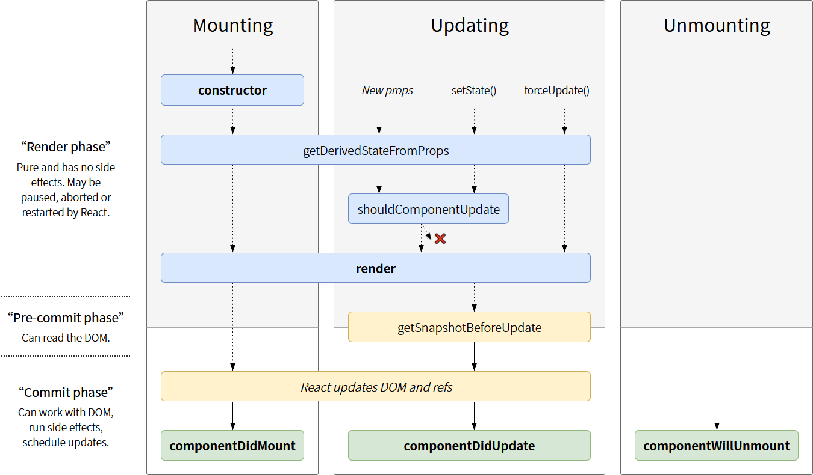

# React

# 生命周期



## 挂载 (mount)

当组件实例被创建并插入 DOM 中时，其生命周期调用顺序如下：

- **`constructor()`**
- `static getDerivedStateFromProps()`
- **`render()`**
- **`componentDidMount()`**

  - 在组件**已经被渲染**到 DOM 中后运行。

## 更新 (updating)

当组件的 props 或 state 发生变化时会触发更新。组件更新的生命周期调用顺序如下：

- `static getDerivedStateFromProps()`
- `shouldComponentUpdate()`
- **`render()`**
- `getSnapshotBeforeUpdate()`
- **`componentDidUpdate()`**

## 卸载 (unmount)

当组件从 DOM 中移除时会调用如下方法：

- **`componentWillUnmount()`**

## Reference

1. [React Docs: React Component](https://zh-hans.reactjs.org/docs/react-component.html)
2. [React Lifecycle Methods Diagram](https://projects.wojtekmaj.pl/react-lifecycle-methods-diagram/)

# Hook

## Effect Hook

可以把 `useEffect` Hook 看做 `componentDidMount`，`componentDidUpdate` 和 `componentWillUnmount` 这三个函数的组合。

## useCallback

返回一个 _memoized 回调函数_。

```javascript
const memoizedCallback = useCallback(() => {
  doSomething(a, b);
}, [a, b]);
```

`useCallback(fn, deps)` 相当于 `useMemo(() => fn, deps)`。

## useMemo

返回一个 _memoized 值_。仅在某个依赖项改变时才重新计算 memoized 值。

```javascript
const memoizedValue = useMemo(() => computeExpensiveValue(a, b), [a, b]);
```
